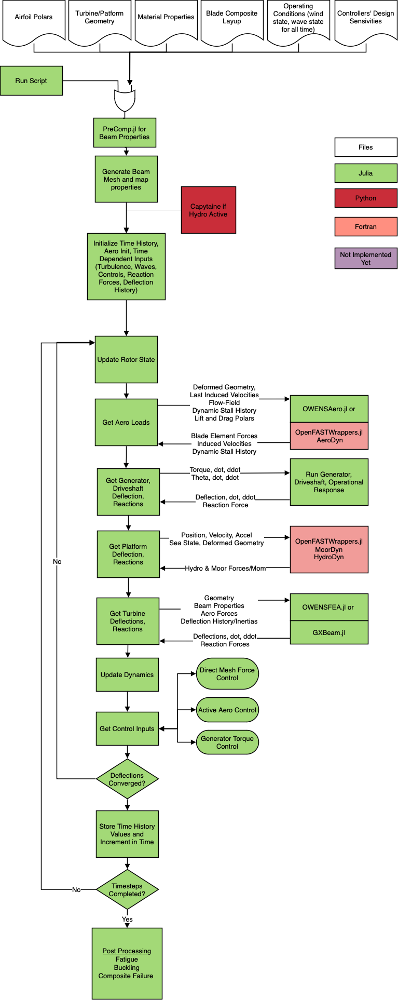

# OWENS (Onshore/Offshore Wind/Water ENergy Simulator)

[](https://sandialabs.github.io/OWENS.jl/dev)

[](https://codecov.io/github/sandialabs/OWENS.jl?branch=master)

* *Documentation:* [sandialabs.github.io/OWENS.jl/](https://sandialabs.github.io/OWENS.jl/dev)
* *Code:* [github.com/sandialabs/OWENS.jl](https://github.com/sandialabs/OWENS.jl)

This package is for experienced researchers and analyists with both software and engineering experience who need generalized flexibility and performance that is 100% open source and is compatible with gradient based optimization with automatic gradients in process.  If you want a windows compatible GUI, please use QBlade.  

OWENS is an ontology, or way of coupling modular aerodynamic, structural, hydrodynamic, and controls packages.  It was originally based on the structural dynamics solver by Brian Owens (see dissertation: http://hdl.handle.net/1969.1/151813). However, it has been rewritten into the Julia programming language, modularized, and many of the issues related to aerodynamic coupling and floating dynamics solved, with extensive expansion into other areas and features to provide a seamless and automated process that takes in high level design details and does all of the preprocessing, running, and post processing that is normally done under different roofs or by different manual processes.  This was done with the intent of enabling fast, parametric design.  We have many of the modules propogating automatic gradients, however this is still a future challenge to solve well. 


## Part of the WETO Stack

OWENS is primarily developed with the support of the U.S. Department of Energy and is part of the [WETO Software Stack](https://nrel.github.io/WETOStack). For more information and other integrated modeling software, see:
- [Portfolio Overview](https://nrel.github.io/WETOStack/portfolio_analysis/overview.html)
- [Entry Guide](https://nrel.github.io/WETOStack/_static/entry_guide/index.html)


## Installation
For Julia 1.11+.  For new Julia users, developer install, and those wishing to use Julia 1.10 and below, see the In-Depth Installation page in the docs.

```julia
using Pkg
Pkg.add(PackageSpec(url="https://github.com/sandialabs/OWENS.jl.git"))
```

<p><br></p>

Note that the following demo was recorded using the julia 1.10 installation method.

<p align="center"> <a href="https://www.youtube.com/watch?v=FTx9Jui_0CA?hd=1">  </a> </p>


Here are several examples of OWENS use cases, current and past, including the Sandia 34m research turbine.


Then here is an example of a helical design.  Note that arbitrary numbers of struts can be specified in the automatic meshing functions.  You can also write your own generalized mesh using the internal building blocks, but it is not thouroughly documented.


The generalized meshing was modified to include HAWT concepts, like this bi-wing concept.  OWENS is capable of axial flow turbines/HAWTs, but it is not a mature feature, and no where near as developed as OpenFAST (i.e. for regular HAWTs it is recommended to use that software).


Then, floating turbines are a possibility, though this feature adds another dimension to the nonlinear time stepping convergance and in turn a fair amount of time.  Future work is to make this general interface and functionality an easy to use feature (right now it needs a high level of experience to use).


# OWENS under the hood

The OWENS.jl package contains functions and interfaces related to the ontology (how everything comes together, forms a wind turbine, and operates like a wind turbine), with preprocessing and postprocessing helper functions. These include automated meshing functions, sectional property mapping, two-way loads mapping, generalized torque and direct mesh controls, algorithms for two-way coupling and time stepping, fatigue and design equivalent load calculation, and all of the ontology and coupling to the other packages used.



OWENSPrecomp.jl is a translation of Precomp and calculates the sectional properties

Composites.jl provides classical laminate theory definitions used for both pre and post processing

OWENSFEA.jl is one of the structural models including a Timoshenko beam solver in the linear and nonlinear steady, modal, time domain, and reduced order modal domains.

GXBeam.jl has also been integrated for geometrically exact beam solutions of the same above

The aerodynamics are provided by the OWENSAero.jl module, or optionally OpenFAST OLAF via OWENSOpenFASTWrappers.jl

Floating dynamics are provided by OWENSOpenFASTWrappers.jl and the HydroDyn and MoorDyn libraries

Turbulent inflow is provided by OWENSOpenFASTWrappers.jl and the inflowwind and turbsim libraries

Rainflow counting was provided by Rainflow.jl, however, this package became orphained and was pulled into the OWENS code base.

## Installation
Please follow the instructions on the setup page in the documentation.

## Documentation
- https://sandialabs.github.io/OWENS.jl
-	All of the functions have docstrings describing the i/o and function purpose, which can be accessed the docs site or by:
    * import module
    * ? module.function() 				
-	A note about julia debuggers – if you don’t want it to step through everything, you need to tell it what packages to compile vs while packages to step through. This will make the debugger comparable (if not faster) than Matlab in speed. In VSCode, this can be done in the debug pane, or by optionally loading the provided VS code profile in the OWENS.jl/docs folder.  This VS code profile will also set up the julia environment and other useful packages and key bindings, and can be modified as desired.

## Software License

Copyright 2021 National Technology & Engineering Solutions of Sandia, LLC (NTESS).
Under the terms of Contract DE-NA0003525 with NTESS, there is a non-exclusive license for use of this work by or on behalf of the U.S. Government.
Export of this data may require a license from the United States Government.

See Copyright.txt file for more information
