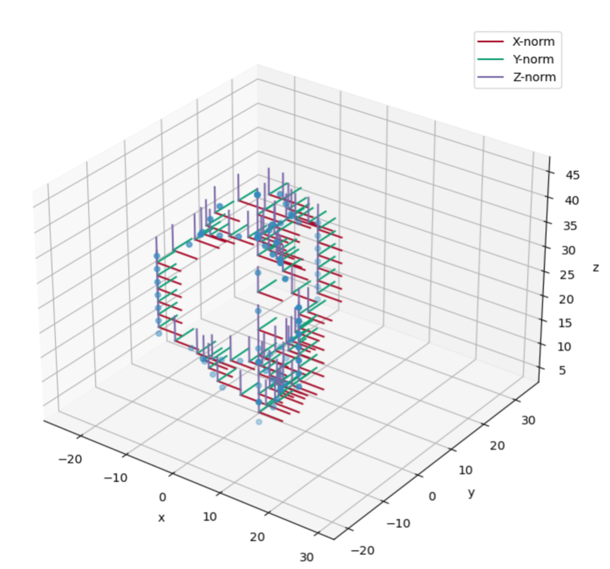
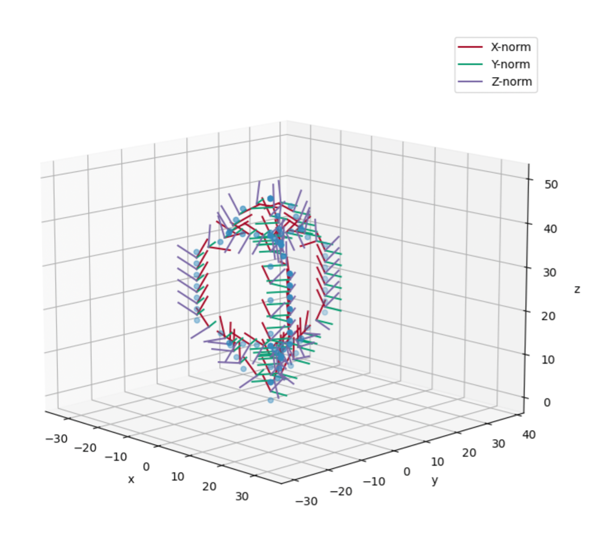

OWENS
X is outwards on blade, y is trailing edge always

Struts, CCW, z is inwards, y trailing, and CW z is outwards

Aerodyn 

if CW z is up, y is trailing (root at bottom) blades, z is outwards and y is towards trailing edge.  If struts have asymmetric, then you need to align your desired suction side with the x-vector, which means you might have to invert your airfoil lookup tables for struts that the suction side isn’t where you want it.

Aerodyn if CCW, root is at top and z is down, y is trailing edge, for struts, z is outwards, and y is trailing edge. 

Hub is rotated such that the axis of rotation is x. So for a VAWT hub-x points up, and hawt hub-x point in x.

{width="4.917280183727034in"
height="4.585993000874891in"}{width="5.469136045494313in"
height="5.071805555555556in"}Meet porcupine the OWENS element
orientation helper. It is comprised of a tower, horizonal struts, and
blades that have both curved and vertical sections. Let's start with all
of the orientations set to 0. We can see that the 1,0,0 norm is in the
positive x direction, and likewise for the y and z norms.

Now, let's turn on just the yaw orientation, (psi in OWENS). The top
blade gets a -90 degree yaw shift (like the other blades), and the other
blades' yaw is additionally rotated to match the global blade
orientation around the turbine axis of rotation. Yes the initial 90
degree shift is confusing, but it is the convention in the structural
solver -- is seems that the z-norm of the blade is intended to be
eventually pointing away from the axis of rotation.

{width="5.595138888888889in"
height="4.875694444444444in"}{width="5.737141294838145in"
height="5.283430664916885in"}

If we add 30 degrees of rotation to the yaw, this is what it looks like.

{width="4.91704615048119in"
height="4.992732939632546in"}

Ok, let's now turn on roll (in addition to yaw), which is the blade
slope, or theta in OWENS. Now, the z norm is no longer always vertical,
but now aligned with the blade slope.

{width="4.382957130358705in"
height="4.783430664916885in"}{width="5.226388888888889in"
height="4.833333333333333in"}

{width="4.406944444444444in"
height="3.9298611111111112in"}If we add 30 degrees of roll, this is what
it looks like:

{width="5.124857830271216in"
height="4.771802274715661in"}

{width="4.45625in"
height="4.469444444444444in"}Now, the blade pitch, also angle of attack,
is generally 0, but can be offset similarly to the yaw, but the rotation
is truly in a blade angle of attack frame of reference. Here it is with
30 degrees offset.

{width="4.095165135608049in"
height="4.388081802274716in"}

In all, these are the rotation matrices were used to create the plots:
Twist/aoa about the x-axis, slope/theta about the y-axis, and psi/yaw
about the z axis.

*\# apply the twist rotation, which is about the x (1) axis*

myvec = myvec\*\[1.0 0.0 0.0

0.0 cosd(Twist_d_el) sind(Twist_d_el)

0.0 -sind(Twist_d_el) cosd(Twist_d_el)\]

*\# apply theta rotation, which is the tilt angle, or about the y (2)
axis in global*

myvec = myvec\*\[cosd(Theta_d_el) 0.0 -sind(Theta_d_el)

0.0 1.0 0.0

sind(Theta_d_el) 0.0 cosd(Theta_d_el)\]

*\# apply Psi rotation, which is about Z (3) axis in global*

myvec = myvec\*\[cosd(Psi_d_el) sind(Psi_d_el) 0.0

-sind(Psi_d_el) cosd(Psi_d_el) 0.0

0.0 0.0 1.0\]
