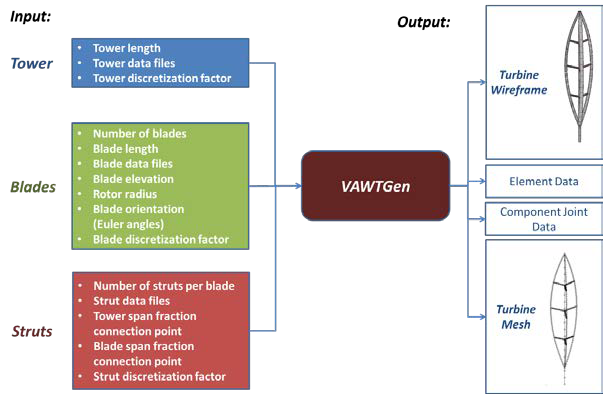

## All of this has been automated, but the option to create and load these legacy files has been preserved.  TODO: show how to do this and condense and modernize this text.

> *Version 1.0 User Guide*
>
> Brian C. Owens
>
> *Wind Energy Technologies*
>
> *Sandia National Laboratories*
>
> November 7, 2013
>
> **Contents**

[Introduction 1](#introduction)

[Overview of VAWTGen Mesh Generator
1](#overview-of-vawtgen-mesh-generator)

[Demonstration 3](#demonstration)

[Conventions Employed in Creating a Model with VAWTGen
5](#conventions-employed-in-creating-a-model-with-vawtgen)

[Structural and aerodynamic description of components
5](#structural-and-aerodynamic-description-of-components)

[Caveats of creating a VAWT configuration in VAWTGen
7](#caveats-of-creating-a-vawt-configuration-in-vawtgen)

[Coordinate system 7](#coordinate-system)

[Tower component 7](#tower-component)

[Blade component 7](#blade-component)

[Blade component 8](#_bookmark15)

[VAWTGen Input File 9](#vawtgen-input-file)

[VAWTGen Command Line Execution 10](#vawtgen-command-line-execution)

[VAWTGen Graphical Output 11](#vawtgen-graphical-output)

[VAWTGen Output Files 15](#_bookmark21)

[OWENS Main Input File (.owens) 15](#owens-main-input-file-.owens)

[Mesh File (.mesh) 16](#mesh-file-.mesh)

[Element Property File (.el) 16](#element-property-file-.el)

[Element Orientation File (.ort) 17](#element-orientation-file-.ort)

[Joint File (.jnt) 17](#joint-file-.jnt)

[Boundary Conditions File (.bc) 17](#boundary-conditions-file-.bc)

[Blade Data File (.bld) 18](#blade-data-file-.bld)

[Output File (.out) 18](#output-file-.out)

[Future Versions 18](#future-versions)

[References 19](#references)

# Introduction

> This user guide presents instructions for using the VAWTGen
> vertical-axis wind turbine (VAWT) mesh generator. This generator is
> intended to be utilized with the Offshore Wind ENergy Simulation
> (OWENS) analysis tool \[1\]. The input files for this mesh generator
> are discussed in detail. Turbine components (tower, blades, and
> struts) are described using existing National Renewable Energy
> Laboratory (NREL) file formats \[2\]. A simple input file sizes these
> basic components and positions them in a hub fixed coordinate frame at
> arbitrary distances from the origin with arbitrary orientation.
> VAWTGen generates a mesh of a VAWT consisting of Timoshenko beam
> elements along with other files describing properties of the VAWT.
> These files serve as inputs to the OWENS analysis tool. VAWTGen also
> visualizes the VAWT assembly and mesh to provide a visual confirmation
> that the VAWT is constructed correctly. Furthermore, VAWTGen can
> visualize the modal and transient results output by the OWENS analysis
> tool.

# Overview of VAWTGen Mesh Generator

> A VAWT rotor primarily consists of a tower and blade components. The
> blades may be affixed to the tower at their ends as in the Darrieus
> and V-VAWT configurations or via struts as in the H-VAWT
> configuration. Struts may also provide a connection between the tower
> and blades at any position along the tower and blade spans. The
> VAWTGen mesh generator is capable of generating VAWTs of arbitrary
> geometry, including H-type, V-type, and Darrieus configurations shown
> in [Figure 1](#_bookmark2). The VAWT configuration is discretized from
> continuous structural components into a finite number of beam
> elements. Elements span between discrete points in the mesh, known as
> nodes. Finite element analysis examines the motions of nodes as
> dictated by the deformation of the beam elements under prescribed
> boundary conditions. This collection of nodes and elements forms the
> mesh of the VAWT configuration.

{width="2.5990562117235347in"
height="1.453332239720035in"}

> []{#_bookmark2 .anchor}**Figure 1 Illustrations of V, H, and Darrieus
> VAWT configurations**
>
> VAWTGen accepts data files containing the basic geometry of tower,
> blade, and strut components. Other crucial configuration information
> is specified such as the elevation of the blade root from the tower
> root, as well as the radial distance the blade root is positioned from
> the tower. An arbitrary number of blades may be specified for the
> configuration. VAWTGen positions the blade roots with equal azimuth
> spacing about the tower axis. The blades may be rotated into an
> arbitrary orientation per a sequence of Euler angles input by the
> user. If required, struts may be inserted between the tower and a
>
> blade by specifying a fraction of the tower span and the blade span
> the strut will span. VAWTGen will insert a straight strut of the
> appropriate length between the tower and blade components. The
> geometry of the strut component is specified by a file containing
> geometric data.
>
> With these relatively minimal set of inputs (as illustrated in [Figure
> 2](#_bookmark3)) a VAWT of arbitrary configuration may be created.
> Therefore, a separate tool is not required for the various types of
> configurations. VAWTGen provides a convenient means to visualize the
> VAWT turbine in a wireframe or rendered format. This serves as a quick
> check for the user to ensure the VAWT has been constructed as
> intended, and shows the actual turbine configuration that the mesh of
> beam elements represents. VAWTGen also visualizes the finite element
> mesh once it is created. VAWTGen identifies points of intersection
> between the various components and inserts nodes accordingly. These
> node pairs at points of intersection (i.e. strut to tower, blade to
> strut, blade to tower) are recorded so appropriate constraint
> conditions at these joints may be imposed. The orientation of the
> finite elements in the mesh is also visualized to ensure the elements
> are positioned and oriented as intended.

{width="4.016800087489064in"
height="2.6266666666666665in"}

> []{#_bookmark3 .anchor}**Figure 2 Input and output of VAWTGen mesh
> generator**
>
> Output includes a mesh file is generated that will be used by the
> analysis software. By default, the mesh is discretized in the same
> manner as the geometric description of components as specified in the
> component data files. The user may further subdivide the mesh by
> specifying an integer factor to further discretize the geometric data
> into elements. An elemental data file is also created, containing the
> structural properties of elements. An orientation file is generated
> containing the Euler angles representing the orientation of the
> elements. VAWTGen requires data files be supplied to describe the
> geometry of the primary turbine components (blades, towers, and
> struts). A joint file is also generated containing nodal information
> about joint locations. This file is used to specify general
> constraints between structural components. A blade file is also
> generated that contains aerodynamic data and
>
> provides information needed for mapping aerodynamic loads to nodal
> locations on the structural model, as well as supplying geometry to
> aerodynamic data and geometry to external aerodynamic modules.
>
> The format of the structural component data files is the same as the
> component files for NREL's FAST code \[2\]. These files describe the
> geometry and aerodynamic properties of general turbine components, and
> there is nothing that restricts their use to horizontal-axis wind
> turbines (HAWTs) specifically. For example, even though a Darrieus
> blade is not likely be installed on a HAWT, it is easily described by
> the NREL's FAST blade geometry file format. This allows existing wind
> energy design tools to be interfaced with the VAWT analysis tool
> without the need to consider new file formats. NREL's FAST separates
> geometrical/structural properties of a blade and aerodynamic
> properties of a blade into two files and the same approach is employed
> in the VAWTGen mesh generator.

# Demonstration

> This section demonstrates the capabilities of the VAWTGen mesh
> generator. First a two bladed V-VAWT configuration is considered.
> [Figure 3](#_bookmark5) shows the wireframe visualization of this
> VAWT. The red line within the wireframe represents the beam flexural
> axis upon which the actual finite element mesh is created. Note that
> the blades may be positioned at any orientation. The blades and top of
> the tower share a common point and can be joined together via a
> constraint relationship that appropriately models the joint. Next, a
> three bladed H-VAWT with multiple strut connections is considered.
> [Figure 4](#_bookmark6) shows the wireframe visualization and mesh for
> the H-VAWT configuration. The blades are oriented at an arbitrary
> orientation, and two strut connections per blade are specified.
> Finally, Darrieus type turbine configurations with swept and strutted
> blades are considered as shown in [Figure 5](#_bookmark7) and [Figure
> 6](#_bookmark8) respectively.
>
> {width="1.8892694663167104in"
> height="3.2266666666666666in"}
> {width="1.3600043744531933in"
> height="3.2133333333333334in"}
>
> []{#_bookmark5 .anchor}**Figure 3 Wireframe of V-VAWT** []{#_bookmark6
> .anchor}**Figure 4 Wireframe of H-VAWT**

{width="1.02086176727909in"
height="3.3866666666666667in"}{width="0.8588167104111986in"
height="3.3866666666666667in"}

+----------------------------------+-----------------------------------+
| > []{#_bookmark7                 | > []{#_bookmark8 .anchor}**Figure |
| > .anchor}**Figure 5 Wireframe   | > 6 Wireframe of Strutted         |
| > of Swept Darrieus VAWT**       | > Darrieus VAWT**                 |
+==================================+===================================+
+----------------------------------+-----------------------------------+

# Conventions Employed in Creating a Model with VAWTGen

> This section describes some specific conventions and caveats of
> creating a mesh of a VAWT using the VAWTGen mesh generator. First, the
> files use to describe the structural and aerodynamic properties of
> files are discussed

## Structural and aerodynamic description of components

> Structural and aerodynamic descriptions of components are specified
> through NREL FAST file format using the blade .dat files and Aerodyn
> .ipt files. For structural description (using the .dat file), only the
> lines highlighted in red are considered by VAWTGen.

+------------+------+-----------+---+------+---+-------+-------+----+
| > **(-)    | *    | >         |   | >    |   | > *   | > **  | ** |
| > (-)**    | *(de |  **(kg/m) |   |  **( |   | *(Nm\ | (N)** | (- |
|            | g)** | >         |   | Nm\^ |   | ^2)** |       | ** |
|            |      | (Nm\^2)** |   | 2)** |   |       |       |    |
+============+======+===========+===+======+===+=======+=======+====+
| > **) (kg  | >    | **(m)**   | * | **(  | > | > **  |       |    |
| > m) (kg** | **m) |           | * | m)** |   | (m)** |       |    |
|            | > (  |           | ( |      | * |       |       |    |
|            | m)** |           | m |      | * |       |       |    |
|            |      |           | ) |      | ( |       |       |    |
|            |      |           | * |      | m |       |       |    |
|            |      |           | * |      | ) |       |       |    |
|            |      |           |   |      | * |       |       |    |
|            |      |           |   |      | * |       |       |    |
+------------+------+-----------+---+------+---+-------+-------+----+

+-----+----+-------+------+-----------------+---------+--------+----+
| >   |    | **0.  | **   | > **9.163e+009  | > *     | > **   | >  |
| **0 |    | 000** | 353. | > 9.163e+009**  | *6.8042 | 8.211e |  * |
| .00 |    |       | 43** |                 | e+009** | +009** | *0 |
| 000 |    |       |      |                 |         |        | .0 |
| > 0 |    |       |      |                 |         |        | 00 |
| .20 |    |       |      |                 |         |        | ** |
| 0** |    |       |      |                 |         |        |    |
+=====+====+=======+======+=================+=========+========+====+
| >   |    | >     | > *  | > **0.000 0.0   | > **    |        |    |
|  ** |    |  **0. | *0.0 | > 0.000**       | 0.000** |        |    |
| 316 |    | 000** | 00** |                 |         |        |    |
| .71 |    |       |      |                 |         |        |    |
| >   |    |       |      |                 |         |        |    |
|  31 |    |       |      |                 |         |        |    |
| 6.7 |    |       |      |                 |         |        |    |
| 1** |    |       |      |                 |         |        |    |
+-----+----+-------+------+-----------------+---------+--------+----+
| >   |    | **0.  | **   | **9.163e+009    | > *     | **     | *  |
| **0 |    | 000** | 353. | 9.163e+009**    | *6.8042 | 8.211e | *0 |
| .05 |    |       | 43** |                 | e+009** | +009** | .0 |
| > 0 |    |       |      |                 |         |        | 00 |
| .20 |    |       |      |                 |         |        | ** |
| 0** |    |       |      |                 |         |        |    |
+-----+----+-------+------+-----------------+---------+--------+----+
| >   |    | >     | > *  | > **0.000 0.0   | > **    |        |    |
|  ** |    |  **0. | *0.0 | > 0.000**       | 0.000** |        |    |
| 316 |    | 000** | 00** |                 |         |        |    |
| .71 |    |       |      |                 |         |        |    |
| >   |    |       |      |                 |         |        |    |
|  31 |    |       |      |                 |         |        |    |
| 6.7 |    |       |      |                 |         |        |    |
| 1** |    |       |      |                 |         |        |    |
+-----+----+-------+------+-----------------+---------+--------+----+
| >   |    | **0.  | **   | **9.163e+009    | > *     | **     | *  |
|  ** |    | 000** | 353. | 9.163e+009**    | *6.8042 | 8.211e | *0 |
| 0.1 |    |       | 43** |                 | e+009** | +009** | .0 |
| > 0 |    |       |      |                 |         |        | 00 |
| .20 |    |       |      |                 |         |        | ** |
| 0** |    |       |      |                 |         |        |    |
+-----+----+-------+------+-----------------+---------+--------+----+
| >   |    | >     | > *  | > **0.000 0.0   | > **    |        |    |
|  ** |    |  **0. | *0.0 | > 0.000**       | 0.000** |        |    |
| 316 |    | 000** | 00** |                 |         |        |    |
| .71 |    |       |      |                 |         |        |    |
| >   |    |       |      |                 |         |        |    |
|  31 |    |       |      |                 |         |        |    |
| 6.7 |    |       |      |                 |         |        |    |
| 1** |    |       |      |                 |         |        |    |
| >   |    |       |      |                 |         |        |    |
| >   |    |       |      |                 |         |        |    |
|  ** |    |       |      |                 |         |        |    |
| \.. |    |       |      |                 |         |        |    |
| .** |    |       |      |                 |         |        |    |
+-----+----+-------+------+-----------------+---------+--------+----+
| > * | >  | **0.  | **   | **9.163e+009    | > *     | **     | *  |
| *0. |  * | 000** | 353. | 9.163e+009**    | *6.8042 | 8.211e | *0 |
| 8** | *0 |       | 43** |                 | e+009** | +009** | .0 |
|     | .2 |       |      |                 |         |        | 00 |
|     | 00 |       |      |                 |         |        | ** |
|     | ** |       |      |                 |         |        |    |
+-----+----+-------+------+-----------------+---------+--------+----+
| > * | ** | >     | > *  | > **0.000 0.0   | > **    |        |    |
| *31 | 31 |  **0. | *0.0 | > 0.000**       | 0.000** |        |    |
| 6.7 | 6. | 000** | 00** |                 |         |        |    |
| 1** | 71 |       |      |                 |         |        |    |
|     | ** |       |      |                 |         |        |    |
+-----+----+-------+------+-----------------+---------+--------+----+
| >   | >  | **0.  | **   | **9.163e+009    | > *     | **     | *  |
|  ** |  * | 000** | 353. | 9.163e+009**    | *6.8042 | 8.211e | *0 |
| 0.8 | *0 |       | 43** |                 | e+009** | +009** | .0 |
| 5** | .2 |       |      |                 |         |        | 00 |
|     | 00 |       |      |                 |         |        | ** |
|     | ** |       |      |                 |         |        |    |
+-----+----+-------+------+-----------------+---------+--------+----+
| > * | ** | >     | > *  | > **0.000 0.0   | > **    |        |    |
| *31 | 31 |  **0. | *0.0 | > 0.000**       | 0.000** |        |    |
| 6.7 | 6. | 000** | 00** |                 |         |        |    |
| 1** | 71 |       |      |                 |         |        |    |
|     | ** |       |      |                 |         |        |    |
+-----+----+-------+------+-----------------+---------+--------+----+
| > * | >  | **0.  | **   | **9.163e+009    | > *     | **     | *  |
| *0. |  * | 000** | 353. | 9.163e+009**    | *6.8042 | 8.211e | *0 |
| 9** | *0 |       | 43** |                 | e+009** | +009** | .0 |
|     | .2 |       |      |                 |         |        | 00 |
|     | 00 |       |      |                 |         |        | ** |
|     | ** |       |      |                 |         |        |    |
+-----+----+-------+------+-----------------+---------+--------+----+
| > * | ** | >     | > *  | > **0.000 0.0   | > **    |        |    |
| *31 | 31 |  **0. | *0.0 | > 0.000**       | 0.000** |        |    |
| 6.7 | 6. | 000** | 00** |                 |         |        |    |
| 1** | 71 |       |      |                 |         |        |    |
|     | ** |       |      |                 |         |        |    |
+-----+----+-------+------+-----------------+---------+--------+----+
| >   | >  | **0.  | **   | **9.163e+009    | > *     | **     | *  |
|  ** |  * | 000** | 353. | 9.163e+009**    | *6.8042 | 8.211e | *0 |
| 0.9 | *0 |       | 43** |                 | e+009** | +009** | .0 |
| 5** | .2 |       |      |                 |         |        | 00 |
|     | 00 |       |      |                 |         |        | ** |
|     | ** |       |      |                 |         |        |    |
+-----+----+-------+------+-----------------+---------+--------+----+
| > * | ** | >     | > *  | > **0.000 0.0   | > **    |        |    |
| *31 | 31 |  **0. | *0.0 | > 0.000**       | 0.000** |        |    |
| 6.7 | 6. | 000** | 00** |                 |         |        |    |
| 1** | 71 |       |      |                 |         |        |    |
|     | ** |       |      |                 |         |        |    |
+-----+----+-------+------+-----------------+---------+--------+----+
| >   | >  | **0.  | **   | > **9.163e+009  | > *     | > **   | >  |
|  ** |  * | 000** | 353. | > 9.163e+009**  | *6.8042 | 8.211e |  * |
| 1.0 | *0 |       | 43** |                 | e+009** | +009** | *0 |
| 000 | .2 |       |      |                 |         |        | .0 |
| 0** | 00 |       |      |                 |         |        | 00 |
|     | ** |       |      |                 |         |        | ** |
+-----+----+-------+------+-----------------+---------+--------+----+
| > * | ** | >     | > *  | > **0.000 0.0   | > **    |        |    |
| *31 | 31 |  **0. | *0.0 | > 0.000**       | 0.000** |        |    |
| 6.7 | 6. | 000** | 00** |                 |         |        |    |
| 1** | 71 |       |      |                 |         |        |    |
|     | ** |       |      |                 |         |        |    |
+-----+----+-------+------+-----------------+---------+--------+----+

> Caveats of blade structural description in VAWTGen are described
> below.

-   {width="4.046369203849519e-3in"
    height="0.15120188101487314in"}The alpha column describing
    bend-twist coupling is not currently employed in the
    analysis.{width="4.046369203849519e-3in"
    height="0.15120188101487314in"}

-   For blades, the reference axis is assumed to pass through the
    quarter chord. The blade may be shaped by using the PrecrvRef and
    PreswpRef parameters.

-   VAWTGen creates a counter clockwise rotating turbine. A positive
    PreswpRef parameter sweeps a blade away from the direction of
    rotation. A positive PrecrvRef will shape a blade outward from the
    machine center.

-   Edgewise elastic axis and mass center offsets are positive towards
    the trailing edge of the blade section.

-   Flapwise elastic axis and mass center offsets are positive in the
    direction outward from the machine center.

-   Under these assumptions, positive structural twist twists the
    leading edge inwards towards the machine center.

-   All other structural properties are the same as that specified in
    the FAST manual\[1\].

> The aerodynamic description of a component is accomplished via the
> Aerodyn .ipt file format. As with the blade properties (.dat) file,
> only certain parts of this file are used by VAWTGen. Specifically, the
> parts used by VAWTGen are highlighted in red in the example file
> below.
>
> Note that the DRNodes and PrnElm columns are not used by VAWTGen but
> must remain in the file for successful reading of the .ipt file. As
> with the conventional use of the file, RNodes denotes a point by a
> physical distance along a blade span from the root. AeroTwst is the
> aerodynamic twist angle in degrees such that a positive twist angle
> rotates the leading edge of the blade inwards towards machine center.
> Chord is used as an aerodynamic property and also for a wireframe
> visualization of a VAWT design.
> N{width="4.046369203849519e-3in"
> height="0.15120188101487314in"}Foil gives an airfoil ID to a section.
> For wireframe visualization purposes the following thickness to chord
> ratios for an elliptical cross-section are specified by the NFoil
> integer: 1 -- 1.0, 2 -- 0.6, 3 - 0.3, all other --
>
> 0.2. These thickness to chord ratios are only employed for
> visualization purposes and do not affect VAWTGen output.

+-------------+-----------+-------------+-------+------+--------------+
| >           | **11.10** | >           | **1   | *    | **NOPRINT**  |
| **2.85833** |           | **2.21667** | .22** | *2** |              |
+=============+===========+=============+=======+======+==============+
| >           | **11.10** | >           | **1   | *    | **NOPRINT**  |
| **5.07500** |           | **2.21667** | .22** | *2** |              |
+-------------+-----------+-------------+-------+------+--------------+
| >           | **11.10** | >           | **1   | *    | **NOPRINT**  |
| **7.29167** |           | **2.21667** | .22** | *2** |              |
+-------------+-----------+-------------+-------+------+--------------+
| >           | **10.41** | >           | **1   | *    | **NOPRINT**  |
| **9.50833** |           | **2.21667** | .22** | *2** |              |
+-------------+-----------+-------------+-------+------+--------------+
| > *         | **8.38**  | >           | **1   | *    | **NOPRINT**  |
| *11.72500** |           | **2.21667** | .22** | *2** |              |
+-------------+-----------+-------------+-------+------+--------------+
| > *         | **6.35**  | >           | **1   | *    | **NOPRINT**  |
| *13.94167** |           | **2.21667** | .22** | *2** |              |
+-------------+-----------+-------------+-------+------+--------------+
| > *         | **4.33**  | >           | **1   | *    | **NOPRINT**  |
| *16.15833** |           | **2.21667** | .22** | *2** |              |
+-------------+-----------+-------------+-------+------+--------------+
| > *         | **2.85**  | >           | **1   | *    | **NOPRINT**  |
| *18.37500** |           | **2.21667** | .22** | *2** |              |
+-------------+-----------+-------------+-------+------+--------------+
| > *         | **2.22**  | >           | **1   | *    | **NOPRINT**  |
| *20.59167** |           | **2.21667** | .22** | *2** |              |
+-------------+-----------+-------------+-------+------+--------------+
| > *         | **1.58**  | >           | **1   | *    | **NOPRINT**  |
| *22.80833** |           | **2.21667** | .22** | *2** |              |
+-------------+-----------+-------------+-------+------+--------------+
| > *         | **0.95**  | >           | **1   | *    | **NOPRINT**  |
| *25.02500** |           | **2.21667** | .22** | *2** |              |
+-------------+-----------+-------------+-------+------+--------------+
| > *         | **0.53**  | >           | **1   | *    | **NOPRINT**  |
| *27.24167** |           | **2.21667** | .22** | *2** |              |
+-------------+-----------+-------------+-------+------+--------------+
| > *         | **0.38**  | >           | **1   | *    | **NOPRINT**  |
| *29.45833** |           | **2.21667** | .22** | *2** |              |
+-------------+-----------+-------------+-------+------+--------------+
| > *         | **0.23**  | >           | **1   | *    | **NOPRINT**  |
| *31.67500** |           | **2.21667** | .22** | *2** |              |
+-------------+-----------+-------------+-------+------+--------------+
| > *         | **0.08**  | >           | **1   | *    | **NOPRINT**  |
| *33.89167** |           | **2.21667** | .22** | *2** |              |
+-------------+-----------+-------------+-------+------+--------------+

## Caveats of creating a VAWT configuration in VAWTGen

> The previous sections discussed the files for describing the various
> components (blades, tower, struts) of a VAWT. This section provides
> details for creating consistent VAWT models using VAWTGen and
> illustrates input parameters.

### Coordinate system

> The following coordinate system z-axis is along the tower axis, and x-
> and y-axes are in the plane of rotation.

### Tower component

> The primary input for the tower component is the tower length or
> height. With this specification, VAWTGen positions the tower
> vertically along the h~3~ axis with the root of the tower at the
> origin of the coordinate system. A straight tower is assumed. Any
> PrecrvRef or PreswpRef specified in the .dat file for the tower is
> ignored.

### Blade component

> The blade components are positioned using the following input
> parameters:

-   Number of blades

-   Blade length

-   Blade root elevation from tower base elevation (z= 0)

-   Blade root radial offset from z-axis (this positions the root of the
    blade at the appropriate x and y coordinates depending on the
    azimuth location of the blade)

-   Blade theta orientation a (degrees, rotation about the y-axis)

-   Blade sweep angle (degrees, rotation about an intermediate "2-axis"
    a positive angle sweeps the blade away from the direction of
    rotation)

> **Notes:**

-   The blade "theta" orientation angle should be negative so that the
    root is at a lower elevation (z-coordinate). A warning message is
    output if blade tip elevation is lower than blade root elevation.

-   Blades will be positioned with equal azimuth spacing of the blade
    root dictated by the specified number of blades.

-   Under this convention the root of "Blade 1" will always be
    positioned at 180 degrees (the x-axis being at 0 degrees azimuth).
    From this position blades are numbered in ascending order counter
    clockwise.

-   This convention of blade placement will also produce element
    orientations with tangential vectors along the trailing edge of a
    cross section and normal vectors outward from the machine center.

> []{#_bookmark15 .anchor}**Strut component**
>
> The strut components (which can provide a structural component between
> the tower and blade connection) are positioned using the following
> input parameters:

-   Fraction of tower span for strut placement

-   Fraction of blade span for strut placement

> VAWTGen will automatically determine the strut length and insert the
> component based off of these two parameters. VAWTGen inserts a
> straight strut with the discretization described in the .dat file for
> the strut. Any PrecrvRef or PreswpRef specified in this file is
> ignored.
>
> VAWTGen will also insert nodes as needed to provide connections
> between the structural components.

# VAWTGen Input File

> As mentioned before, the structural component (tower, blade, and
> struts) are described by the NREL file formats \[1\] and will not be
> discussed here. The main input file for VAWTGen is described below.
> This example input file is for a three bladed VAWT with struts, but
> without swept blades. The commented input file shown below is
> sufficient for explanation and will not be discussed further.

# VAWTGen Command Line Execution

> VAWTGen is written using the MATLAB programming language. The VAWTGen
> source code directory should be added to the MATLAB path, and VAWTGen
> should be executed from a job directory containing the component data
> files (.dat and .ipt NREL formats), and the VAWTGen input file
> described in the following section. The command line input should be
> executed in the MATLAB command window as:
>
> vawtGen(inputFile,outputFileRootName,renderBool,zeroTolerance);
>
> For example:
>
> vawtGen('snl34m.in','snl34m',true,1.0e-5);
>
> Results in execution with "snl34m.in" as the main VAWTGen input file.
> Resulting output files would have the root "snl34m", such as
> "snl34m.mesh", "snl34m.el", etc. The renderBool produces a rendered
> surface plot of the turbine if set to true, and no rendered view if
> set to "false". The zeroTolerance variable specifies a tolerance to be
> considered numerical zero when searching for coincident points in the
> configuration for identifying locations where joints are to be
> specified. If excluded from the command line input a default value of
> 1.0e-6 is used.
>
> Command line output from VAWTGen consists of a set of minimum element
> length ratios to the length of the actual structural component. This
> allows the user to ensure that element lengths are not too small to
> cause problems with the structural dynamics simulation. The located
> joints in the model are also displayed with information of the master
> and slave node numbers and component types.
>
> A variety of examples are available in the "sampleJobs" directory
> distributed with VAWTGen. They may be executed by adding the VAWTGen
> directory to the MATLAB path and running the "generateMesh.m" scripts
> in the example job directory.
>
> A sample command line output is shown below:

+--------+----------------+--------------------------------------------+
| > \>\> |                |                                            |
| > vawt |                |                                            |
| Gen(\' |                |                                            |
| ideal3 |                |                                            |
| 4m.in\ |                |                                            |
| ',\'id |                |                                            |
| eal34m |                |                                            |
| \',0); |                |                                            |
| >      |                |                                            |
| > \*   |                |                                            |
| \*\*\* |                |                                            |
| \*\*\* |                |                                            |
| \*\*\* |                |                                            |
| \*\*\* |                |                                            |
| \*\*\* |                |                                            |
| \*\*\* |                |                                            |
| \*\*\* |                |                                            |
| \*\*\* |                |                                            |
| \*\*\* |                |                                            |
| \*\*\* |                |                                            |
| \*\*\* |                |                                            |
| \*\*\* |                |                                            |
| \*\*\* |                |                                            |
| \*\*\* |                |                                            |
| \*\*\* |                |                                            |
| \*\*\* |                |                                            |
| \*\*\* |                |                                            |
| \*\*\* |                |                                            |
| \*\*\* |                |                                            |
| \*\*\* |                |                                            |
| \*\*\* |                |                                            |
| \*\*\* |                |                                            |
| \*\*\* |                |                                            |
|        |                |                                            |
| -      |                |                                            |
|    SNL |                |                                            |
|     V  |                |                                            |
| AWTGen |                |                                            |
|        |                |                                            |
|   V1.0 |                |                                            |
|     \* |                |                                            |
|        |                |                                            |
| -      |                |                                            |
|    Dev |                |                                            |
| eloped |                |                                            |
|     by |                |                                            |
|        |                |                                            |
| Sandia |                |                                            |
|     Na |                |                                            |
| tional |                |                                            |
|        |                |                                            |
| Labora |                |                                            |
| tories |                |                                            |
|        |                |                                            |
|   Wind |                |                                            |
|        |                |                                            |
| Energy |                |                                            |
|        |                |                                            |
| Techno |                |                                            |
| logies |                |                                            |
|     \* |                |                                            |
|        |                |                                            |
| -      |                |                                            |
|    See |                |                                            |
|        |                |                                            |
|  licen |                |                                            |
| se.txt |                |                                            |
|        |                |                                            |
|    for |                |                                            |
|        |                |                                            |
|   disc |                |                                            |
| laimer |                |                                            |
|        |                |                                            |
|  infor |                |                                            |
| mation |                |                                            |
|     \* |                |                                            |
|        |                |                                            |
| > \*   |                |                                            |
| \*\*\* |                |                                            |
| \*\*\* |                |                                            |
| \*\*\* |                |                                            |
| \*\*\* |                |                                            |
| \*\*\* |                |                                            |
| \*\*\* |                |                                            |
| \*\*\* |                |                                            |
| \*\*\* |                |                                            |
| \*\*\* |                |                                            |
| \*\*\* |                |                                            |
| \*\*\* |                |                                            |
| \*\*\* |                |                                            |
| \*\*\* |                |                                            |
| \*\*\* |                |                                            |
| \*\*\* |                |                                            |
| \*\*\* |                |                                            |
| \*\*\* |                |                                            |
| \*\*\* |                |                                            |
| \*\*\* |                |                                            |
| \*\*\* |                |                                            |
| \*\*\* |                |                                            |
| \*\*\* |                |                                            |
| \*\*\* |                |                                            |
| > Zero |                |                                            |
| > tol  |                |                                            |
| erance |                |                                            |
| > set  |                |                                            |
| > to   |                |                                            |
| > d    |                |                                            |
| efault |                |                                            |
| > of   |                |                                            |
| >      |                |                                            |
| 1.0e-6 |                |                                            |
| >      |                |                                            |
| > M    |                |                                            |
| inimum |                |                                            |
| > e    |                |                                            |
| lement |                |                                            |
| > to   |                |                                            |
| > com  |                |                                            |
| ponent |                |                                            |
| >      |                |                                            |
| length |                |                                            |
| > r    |                |                                            |
| atios: |                |                                            |
| > Com  |                |                                            |
| ponent |                |                                            |
| > 1 :  |                |                                            |
| > 0.   |                |                                            |
| 050000 |                |                                            |
| >      |                |                                            |
| > Com  |                |                                            |
| ponent |                |                                            |
| > 2 :  |                |                                            |
| > 0.   |                |                                            |
| 050000 |                |                                            |
| >      |                |                                            |
| > Com  |                |                                            |
| ponent |                |                                            |
| > 3 :  |                |                                            |
| > 0.   |                |                                            |
| 050000 |                |                                            |
| >      |                |                                            |
| > 4    |                |                                            |
| >      |                |                                            |
| Joints |                |                                            |
| > lo   |                |                                            |
| cated: |                |                                            |
+========+================+============================================+
| >      | > Master -     | > Component Type T Component Type B        |
|  Joint | > Node #1,     |                                            |
| > 1:   | > Slave - Node |                                            |
|        | > #22,         |                                            |
+--------+----------------+--------------------------------------------+
| >      | > Master -     | > Component Type T Component Type B        |
|  Joint | > Node #1,     |                                            |
| > 2:   | > Slave - Node |                                            |
|        | > #43,         |                                            |
+--------+----------------+--------------------------------------------+
| >      | > Master -     | > Component Type T Component Type B        |
|  Joint | > Node #21,    |                                            |
| > 3:   | > Slave - Node |                                            |
|        | > #42,         |                                            |
+--------+----------------+--------------------------------------------+
| >      | > Master -     | > Component Type T Component Type B        |
|  Joint | > Node #21,    |                                            |
| > 4:   | > Slave - Node |                                            |
|        | > #63,         |                                            |
+--------+----------------+--------------------------------------------+

# VAWTGen Graphical Output

> VAWTGen has various graphical outputs after creating a mesh of a VAWT
> configuration. First, a wire- frame visualization (and surface
> rendering if requested) is created to allow the user to visually
> inspect the turbine was constructed as intended. These are shown in
> [Figure 3](#_bookmark5) through [Figure 6](#_bookmark8). The finite
> element mesh with node numbering is also visualized as shown in
> [Figure 7](#_bookmark19). Figure 8 shows the element orientations
> *e~1~* is the local axial direction of an element, *e~2~* is the local
> edgewise direction of an element, and *e~3~* is the local flapwise
> direction of an element.
>
> Finite Element Mesh
>
> Element Orientation Visualization
>
> {width="2.202673884514436in"
> height="2.950511811023622in"}{width="2.1219225721784776in"
> height="2.6937674978127735in"}40
>
> 35
>
> 30
>
> 25
>
> 20
>
> 15

10

5

0

1 0-1

-15

15

> 10
>
> 5
>
> 0
>
> -5
>
> -10
>
> x
>
> []{#_bookmark19 .anchor}**Figure 7. Finite element mesh with node
> numbering Figure 8. Finite element mesh with element orientations**
>
> **Visualization of OWENS Output using VAWTGen**
>
> A number of visualization options exist in VAWTGen for results
> obtained with the OWENS analysis tool. This section discusses the
> available options for modal and transient analysis results. These
> function are located in the "vizFiles" directory of the VAWTGen
> distribution.
>
> **Visualization of Static Analysis Results**
>
> The MATLAB function staticPlotter.m will visualize the deformed mesh
> from a static analysis. This visualization option shows multiple views
> of the turbine, with the undeformed mesh, and deformed mesh
> overlaying. The undeformed mesh is plotted in black, and the deformed
> mesh is plotted in red. The viz function is executed with the
> following command line call:
>
> staticPlotter(meshFile,resultsFile,scaleFactor);
>
> Such that meshFile is the mesh filename (.mesh), resultsFile is the
> OWENS output file from static analysis (\_static.mat), and scaleFactor
> scales the deformed mesh.
>
> **Visualization of Modal Analysis Results**
>
> The MATLAB function viz.m will visualize the mode shapes for a
> particular mode. This visualization option shows multiple views of the
> turbine, with the undeformed mesh, 0 degree mode shape, and 90 degree
> mode shape overlaying. The undeformed mesh is plotted in black, 0
> degree mode shape in red, and 90 degree mode shape in blue. The viz
> function is executed with the following command line call:
>
> viz(meshFile,resultsFile,selectedMode,scaleFactor);
>
> Such that meshFile is the mesh filename (.mesh), resultsFile is the
> OWENS output file from modal analysis (.out), selectedMode is an
> integer mode number, and scaleFactor scales the mode shape
> deformation.
>
> An example of an actual viz function execution is:
> viz(\'snl34m.mesh\',\'snl34m.out\',2,3) The resulting plot is shown in
> [Figure 9](#_bookmark20) below:
>
> []{#_bookmark21
> .anchor}{width="2.5578937007874014in"
> height="2.013333333333333in"}
>
> []{#_bookmark20 .anchor}**Figure 9 Mode shape visualization using
> viz.m**
>
> A similar capability exists for generating animated mode shapes. The
> vizAnimateModal function is utilized in the following manner:
>
> vizAnimateModal(meshFile,resultsFile,selectedMode,sf,outFileName);
>
> All the input parameters are the same as those for viz, however, the
> last parameter specifies a file name for a AVI movie file.
>
> **Visualization of Transient Analysis Results**
>
> A visualization option of transient results as an animation of the
> motion history of the turbine structure is accomplished via the
> vizAnimateTransient function. The command line argument is executed
> as:
>
> vizAnimateTransient(meshFile,uData,sf,outFileName);
>
> Such that mesh file is the mesh filename (.mesh), uData is an n x m
> array holding displacement data for n degrees of freedom at m time
> steps, and sf is the deformation scale factor for the structural mesh.
> The AVI movie file is generated using outFileName.

# VAWTGen Output Files

> The following output files are generated to serve as input for the
> OWENS analysis tool:

-   OWENS main input file (.owens)

-   Beam mesh file (.mesh)

-   Element property file (.el)

-   Element orientation file (.ort)

-   Joint file (.jnt)

-   Boundary conditions file (.bc)

-   Blade data file (.bld)

> Additionally, a log file describing the junctions of various
> structural components is generated in a .out output file.

## OWENS Main Input File (.owens)

> The OWENS main input file is generated with the following format:
>
> Here, the root file name of "vawt" was specified at the command line
> input for VAWTGen. Command line usage will be discussed in a later
> section. The associated mesh, element, orientation, joint, and
> boundary conditions file are listed. The bracketed file comments serve
> as place holders and are not essential for all OWENS analysis types.
> These file types will be discussed separately in the OWENS analysis
> tool user guide. Lines 7 , 9, and 10 contain certain flags that are
> used by the OWENS software. The two doubles on the 12^th^ line are
> damping parameters for Rayleigh damping. These are discussed in the
> OWENS user guide\[1\].

## Mesh File (.mesh)

> The mesh file generated by VAWTGen simply lists nodal coordinates and
> element connectivity. The number of structural components (tower,
> blades, and struts) and number of elements per component are also
> listed in this file. The file format is described below:

+---------+----------+-------+---------------+-----------------------+
| > n     | > num    | > y   | > zCoord      |                       |
| umNodes | Elements | Coord |               |                       |
| >       | >        |       |               |                       |
| >       | > xCoord |       |               |                       |
| nodeNum |          |       |               |                       |
+=========+==========+=======+===============+=======================+
| >       | > xCoord | > y   | > zCoord      |                       |
| nodeNum |          | Coord |               |                       |
+---------+----------+-------+---------------+-----------------------+
| >       | > xCoord | > y   | > zCoord      |                       |
| nodeNum |          | Coord |               |                       |
| >       |          |       |               |                       |
| > \...  |          |       |               |                       |
+---------+----------+-------+---------------+-----------------------+
| > ele   | > nu     |       | >             | > localNodeNum2       |
| mentNum | mNodesPe |       | localNodeNum1 |                       |
|         | rElement |       |               |                       |
+---------+----------+-------+---------------+-----------------------+
| > ele   | > nu     |       | >             | > localNodeNum2       |
| mentNum | mNodesPe |       | localNodeNum1 |                       |
|         | rElement |       |               |                       |
+---------+----------+-------+---------------+-----------------------+
| > ele   | > nu     |       | >             | > localNodeNum2       |
| mentNum | mNodesPe |       | localNodeNum1 |                       |
| >       | rElement |       |               |                       |
| > \...  |          |       |               |                       |
+---------+----------+-------+---------------+-----------------------+

## Element Property File (.el)

> The element property file generated by VAWTGen contains element
> mechanical and some aerodynamic properties. The properties specified
> in this file are those defined in the NREL file formats \[1\], but
> sorted into a form that is more usable by the OWENS analysis tool. The
> file has the following format:

## Element Orientation File (.ort)

> The element orientation file generated by VAWTGen lists Euler angles
> for a 3-2 rotation sequence and some other miscellaneous element
> information. The file format is described below:
>
> Such that elNum is the element number. Theta3, theta2, and theta1 are
> the orientation angles (degrees) about a 3, 2, and 1 axes respectively
> for a 3-2-1 Euler rotation sequence. Length is the element length, and
> x/y/zOffsets are the offsets of the first node of the element from the
> coordinate frame origin.

## Joint File (.jnt)

> The joint file generated by VAWTgen specifies joint conditions at
> coincident nodes between structural components. The file format for
> the joint file is shown below:
>
> A master and slave node is defined at a joint from which constraints
> will be developed. The joint type is also specified (0 = weld(fixed),
> 1=pinned, 2 = hinge joint with axis about slave node element's e~2~
> axis, 3 = hinge joint axis about slave node element's e~1~ axis, 4 =
> hinge joint axis about slave node element's e~3~ axis). The mass of
> the joint may be specified in this file. If this option is not
> sufficient for modeling purposes concentrated mass can be imposed on
> degrees of freedom using the .ndl file. A place-holder double of zero
> after jointMass is also in this file, but not currently used in
> analysis. The orientation associated with the joint is also described
> by the jointPsi and jointTheta angles (degrees). These angles are used
> to transform from the global coordinate frame to the local
> element/joint frame via a 3-2 Euler rotation sequence. Psi denotes
> rotation about 3, theta denotes rotation about 2.

## Boundary Conditions File (.bc)

> The boundary conditions file generated by VAWTGen specifies a fixed
> boundary condition at the tower base (node 1). This file specifies the
> number of boundary conditions, the node number, local degree of
> freedom, and specified displacement value for the boundary condition.
> This file attempts to provide a likely boundary condition for a VAWT
> structure, but may need to be modified by the analyst depending on the
> specific configuration of interest. The boundary condition file
> generated by VAWTGen is shown below:

## Blade Data File (.bld)

> A blade data file is generated by VAWTGen to aid in mapping
> aerodynamic loads to the structural mesh generated by VAWTGen. This
> information includes the blade number, node locations of blade
> sections in terms of spanwise distance from the blade root, and node
> number and element numbers associated with these locations. The file
> also contains the quarter chord coordinate of the blade section, the
> normal and tangential vector components of the blade section, and the
> chord of the section. Coordinate and vector components are represented
> in the rotating, rotor-fixed hub frame. An integer number representing
> the airfoil as specified in the .ipt file for the blade component and
> section lift curve slope are also specified. The last column is a
> place holder not used in the release version of OWENS. The file format
> for the blade file is described below:

# Output File (.out)

> This file describes the various component junctions in the generated
> turbine model. An example of the file is shown below. "T", "B", and
> "S" denote tower, blade, and strut components. "T/B" denotes a tower
> blade junction. The component numbers present at this junction are
> also output for more detail. By default, the tower component is
> labeled as component 1. Blade components are considered next in a
> counter clockwise azimuthal direction with the first blade located at
> 180 degrees azimuth from the x- axis. Struts are numbered last, per
> blade in a clockwise manner.

+---+-------+----+---------------------------------------------------+
| T | > jun | >  | > (1-2)                                           |
| / | ction |  f |                                                   |
| B |       | ou |                                                   |
|   |       | nd |                                                   |
+===+=======+====+===================================================+
| T | > jun | >  | > (1-2)                                           |
| / | ction |  f |                                                   |
| B |       | ou |                                                   |
|   |       | nd |                                                   |
+---+-------+----+---------------------------------------------------+
| T | > jun | >  | > (1-3)                                           |
| / | ction |  f |                                                   |
| B |       | ou |                                                   |
|   |       | nd |                                                   |
+---+-------+----+---------------------------------------------------+
| T | > jun | >  | > (1-3)                                           |
| / | ction |  f |                                                   |
| B |       | ou |                                                   |
|   |       | nd |                                                   |
+---+-------+----+---------------------------------------------------+
| T | > jun | >  | > (1-4)                                           |
| / | ction |  f |                                                   |
| S |       | ou |                                                   |
|   |       | nd |                                                   |
+---+-------+----+---------------------------------------------------+
| T | > jun | >  | > (1-5)                                           |
| / | ction |  f |                                                   |
| S |       | ou |                                                   |
|   |       | nd |                                                   |
+---+-------+----+---------------------------------------------------+
| T | > jun | >  | > (1-6)                                           |
| / | ction |  f |                                                   |
| S |       | ou |                                                   |
|   |       | nd |                                                   |
+---+-------+----+---------------------------------------------------+
| T | > jun | >  | > (1-7)                                           |
| / | ction |  f |                                                   |
| S |       | ou |                                                   |
|   |       | nd |                                                   |
+---+-------+----+---------------------------------------------------+
| B | > jun | >  | > (2-1)                                           |
| / | ction |  f |                                                   |
| T |       | ou |                                                   |
|   |       | nd |                                                   |
+---+-------+----+---------------------------------------------------+
| B | > jun | >  | > (2-1)                                           |
| / | ction |  f |                                                   |
| T |       | ou |                                                   |
|   |       | nd |                                                   |
+---+-------+----+---------------------------------------------------+
| B | > jun | >  | > (2-3)                                           |
| / | ction |  f |                                                   |
| B |       | ou |                                                   |
|   |       | nd |                                                   |
+---+-------+----+---------------------------------------------------+
| \ |       |    |                                                   |
| . |       |    |                                                   |
| . |       |    |                                                   |
| . |       |    |                                                   |
+---+-------+----+---------------------------------------------------+

# Future Versions

> There are no planned future developments for VAWTGen. Future
> developments or modifications will be considered as analysis needs
> arise.

# References

1.  OWENS User Guide

2.  Jonkman, J.M., and Buhl, M. L., 2005, FAST User's Guide, National
    Renewable Energy Laboratory, NREL/EL- 500-38230.
