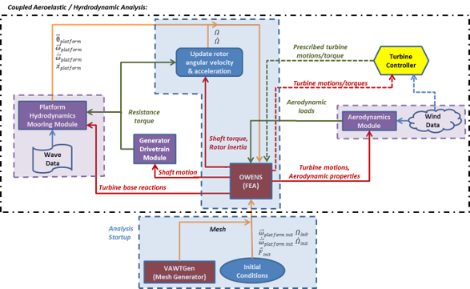

## TODO: condense and update this with the latest updates
---
subtitle: |
  Version 1.0

  User Guide

  *Brian C. Owens\
  *

  *Wind Energy Technologies\
  Sandia National Laboratories*

  *November 11, 2013\
  *
title: |
  Offshore Wind Energy Simulation

  Analysis Tool: OWENS
---

# Contents {#contents .TOC-Heading}

[Introduction [1](#introduction)](#introduction)

[Overview of OWENS Model Formulation
[1](#overview-of-owens-model-formulation)](#overview-of-owens-model-formulation)

[Basic Formulation Concepts
[1](#basic-formulation-concepts)](#basic-formulation-concepts)

[Equations of Motion [2](#equations-of-motion)](#equations-of-motion)

[Overview of OWENS Analysis Framework
[4](#overview-of-owens-analysis-framework)](#overview-of-owens-analysis-framework)

[OWENS Installation [7](#owens-installation)](#owens-installation)

[Platform dynamics software interface
[7](#platform-dynamics-software-interface)](#platform-dynamics-software-interface)

[OWENS Command Line Execution
[8](#owens-command-line-execution)](#owens-command-line-execution)

[Static Analysis Execution
[8](#static-analysis-execution)](#static-analysis-execution)

[Modal Analysis Execution
[8](#modal-analysis-execution)](#modal-analysis-execution)

[Creating Campbell Diagrams of a VAWT Configuration
[9](#creating-campbell-diagrams-of-a-vawt-configuration)](#creating-campbell-diagrams-of-a-vawt-configuration)

[Transient Analysis Execution
[11](#transient-analysis-execution)](#transient-analysis-execution)

[Specified rotor speed profile
[11](#specified-rotor-speed-profile)](#specified-rotor-speed-profile)

[Forced start-up mode using generator
[11](#forced-start-up-mode-using-generator)](#forced-start-up-mode-using-generator)

[Self-starting turbine mode
[12](#self-starting-turbine-mode)](#self-starting-turbine-mode)

[Transient Analysis Execution Using Reduced Order Model
[12](#transient-analysis-execution-using-reduced-order-model)](#transient-analysis-execution-using-reduced-order-model)

[OWENS Input Files [13](#owens-input-files)](#owens-input-files)

[OWENS Main Input File (.owens)
[14](#owens-main-input-file-.owens)](#owens-main-input-file-.owens)

[Mesh File (.mesh) [15](#mesh-file-.mesh)](#mesh-file-.mesh)

[Element Property File (.el)
[15](#element-property-file-.el)](#element-property-file-.el)

[Element Orientation File (.ort)
[16](#element-orientation-file-.ort)](#element-orientation-file-.ort)

[Joint File (.jnt) [16](#joint-file-.jnt)](#joint-file-.jnt)

[Concentrated Nodal Terms File
[16](#concentrated-nodal-terms-file)](#concentrated-nodal-terms-file)

[Boundary Conditions File (.bc)
[17](#boundary-conditions-file-.bc)](#boundary-conditions-file-.bc)

[Platform Simulation File (.plat)
[17](#platform-simulation-file-.plat)](#platform-simulation-file-.plat)

[Initial Conditions File
[18](#initial-conditions-file)](#initial-conditions-file)

[Blade Data File (.bld)
[18](#blade-data-file-.bld)](#blade-data-file-.bld)

[Aerodynamic Loads File
[18](#aerodynamic-loads-file)](#aerodynamic-loads-file)

[Drivetrain Properties File
[18](#drivetrain-properties-file)](#drivetrain-properties-file)

[Generator Properties File
[19](#generator-properties-file)](#generator-properties-file)

[OWENS Output Files [20](#owens-output-files)](#owens-output-files)

[Static Analysis Output
[20](#static-analysis-output)](#static-analysis-output)

[Modal Analysis Output
[20](#modal-analysis-output)](#modal-analysis-output)

[Transient Analysis Output
[21](#transient-analysis-output)](#transient-analysis-output)

[References [21](#references)](#references)

[Appendix A: Mapping from local nodal DOF numbering to global DOF
numbering
[22](#appendix-a-mapping-from-local-nodal-dof-numbering-to-global-dof-numbering)](#appendix-a-mapping-from-local-nodal-dof-numbering-to-global-dof-numbering)

# Introduction

This user guide presents instructions for using the Offshore Wind ENergy
Simulation (OWENS) analysis tool. This structural dynamics finite
element analysis tool is intended to be used for the analysis of
vertical-axis wind turbine (VAWT) on a floating platform, and is used in
conjunction with the VAWTGen mesh generator described in a separate user
manual\[1\]. An overview of the OWENS analysis tool is presented. The
execution, analysis modes, input files, and resulting output files for
OWENS are discussed in detail. Visualization options for modal and
transient analysis are also presented. Version 1.0 of OWENS presents a
structural dynamics tool for modal and transient analysis of an
arbitrary VAWT structure affixed to a floating platform. Simple
drivetrain and generator modules are also present in this version.
Future work will implement fully coupled hydrodynamic, aerodynamic, and
more robust nonlinear formulations.

# 

# Overview of OWENS Model Formulation

The fundamental requirements of the aeroelastic analysis tool for
off-shore VAWTs necessitates a flexible framework capable of considering
arbitrary configuration geometries, arbitrary loading scenarios, and the
ability to interface with various modules that account for the
interaction of the environment and power generation hardware with the
turbine structure. The finite element method provides a means to satisfy
these general requirements. If a sufficiently robust element is
developed, a mesh (collection of elements) of an arbitrary VAWT
configuration may be constructed via a mesh generator. The ability to
capture various couplings and provide an accurate representation of
turbine behavior will depend on the robustness of the element
formulation.

The finite element method requires boundary conditions to be imposed on
the elements by specifying loads or displacements at discrete points
(nodes) in the mesh. These boundary conditions provide a clear interface
between aerodynamic and hydrodynamic modules that impart forces on the
turbine. With boundary conditions specified, unspecified displacements
and loads may be calculated. Next, displacement motions of the turbine
may be provided to aerodynamic and hydrodynamic modules to calculate
loads on the turbine. This gives rise to mutual causation because in
reality loads and displacements are intricately connected. Iterative
procedures, however, often allow for a convergence to be reached,
eliminating this issue for all practical purposes.

The subsections that follow will present basic formulation concepts for
the OWENS analysis tool.

## Basic Formulation Concepts

Basic formulation concepts will be discussed before describing
components of the proposed formulation in detail. As stated earlier, the
finite element method is utilized for its robustness and flexibility. A
robust element formulation will become the foundation of the aeroelastic
analysis tool. Analysis of the dynamic response of the turbine is
challenging because of rotating components. Because almost all
structural components of the turbine will be rotating at some rotor
speed (𝛺), it is convenient to perform the formulation in a rotating
reference frame. Such a frame is capable of capturing rotational
effects, including centrifugal stiffening/softening and Coriolis
effects.

### Equations of Motion

Equations of motion for the platform are developed by treating the
platform as a rigid body, whereas the turbine is treated as a rotating
deformable body. Motions of discrete points on the turbine can be
expressed as the sum of the turbine motion (deformation and rigid rotor
rotation) and the platform motion (rigid). Expressions for the
velocities of the platform and for an arbitrary point on the turbine are
shown below:

$${\overset{⃑}{V}}_{platform} = {\frac{_{}^{(N)}d}{\ dt}{\overset{⃑}{R}}_{P/N} = \dot{U}}_{1}{\widehat{n}}_{1} + {\dot{U}}_{2}{\widehat{n}}_{2} + {\dot{U}}_{3}{\widehat{n}}_{3}$$

$${\overset{⃑}{\omega}}_{platform} = \omega_{1}{\widehat{p}}_{1} + \omega_{2}{\widehat{p}}_{2} + \omega_{3}{\widehat{p}}_{3}$$

$$\overset{⃑}{v} = {\overset{⃑}{V}}_{platform} + {\lbrack(\overset{⃑}{\omega}}_{platform} + \Omega{\widehat{h}}_{3}) \times \overset{⃑}{r}\rbrack + \frac{_{}^{(H)}d}{\ dt}\overset{⃑}{r}$$

{width="2.3in"
height="2.28in"}

Figure 1 Illustration of frames, position vectors, and angular
velocities

Figure 1 presents an illustration of the frames, angular velocities, and
positions vectors that will be described. Here, *U~i~* represents the
displacement components of the platform center of mass, and *𝜔~i~*
represents the angular velocity components of the platform. The inertial
frame is represented by the *n~i~* coordinate axes, the platform frame
is represented by the *p~i~* coordinate axes, and the rotating hub frame
is represented by the *h~i\ ~*coordinate axes. The vector *r* defines
the position of an arbitrary point on the turbine with respect to the
hub frame origin. The time derivative of this vector is taken within the
hub frame and is essentially the time derivative of turbine
deformations. The platform and hub frame origins are coincident, and
there is no translational velocity of the hub frame relative to the
turbine frame. Hamilton's principle relates the variation of kinetic
energy (*T*) and potential energy (*V*), and virtual work of
non-conservative forces *(δW~np­~*) to formulate equations of motion.
Hamilton's extended principle is written simply as:

$$\delta\int_{t_{1}}^{t_{2}}{\left\lbrack T(t) - V(t) \right\rbrack dt +}\int_{t_{1}}^{t_{2}}{\delta W_{np} = 0}$$

The kinetic energy of the system may be written compactly as:

$$T_{system} = T_{platform} + T_{turbine}$$

$$T_{platform} = \frac{1}{2}M_{platform}{\overset{⃑}{V}}_{platform} \bullet {\overset{⃑}{V}}_{platform} + \frac{1}{2}{{(\overset{⃑}{\omega}}_{platform})}^{T}\lbrack J\rbrack{\overset{⃑}{\omega}}_{platform}$$

$$T_{turbine} = \frac{1}{2}\int_{V}^{}\rho\overset{⃑}{v} \bullet \overset{⃑}{v}dV$$

The platform kinetic energy is decomposed into two parts, translational
kinetic energy and rotational kinetic energy (where \[J\] is the moment
of inertia tensor for the platform). The turbine (which will be
represented by a collection of elements) kinetic energy is expressed in
terms of the volume integral of the turbine density and the velocity of
infinitesimal points in the turbine (as developed earlier).

Note that the quantities described above may be represented or
"coordinatized" in any frame. Indeed, some vectors were expressed in the
inertial (*n~i~*) frame, and others in the rotating hub (*h~i~*) frame.
Because the rotating turbine represents the bulk of the modeling effort,
the implementation of the equations of motion will be coordinatized in
the hub frame. Platform motions and forces, however, are described in
the inertial or platform frames. Therefore, transformations between the
various frames are performed where necessary.

In the development of equations of motion, one can choose to retain the
rotor angular velocity/acceleration ($\Omega$) and platform angular
velocity/acceleration ($\omega_{i})$ as degrees of freedom in the
resulting system of equations or as specified parameters. Retaining
these terms as degrees of freedom is undesirable because it adds
significant complexity to the formulation and introduces a significant
number of nonlinear terms. More critically, however, is that the
analysis tool must be interfaced with independent modules for
aerodynamics, hydrodynamics, and generator dynamics that will affect
these rotational motion quantities. Therefore, it is not possible to
retain these variables as degrees of freedom in the model formulation
without losing the ability to interface generic modules. Accordingly,
these variables will be retained as specified motion parameters. The
value of these parameters will be updated by post-processing routines
after gathering information from the aforementioned modules and turbine
motions.

The resulting equations of motion for a floating turbine structure will
be of the following form (hyperbolic):

$$\lbrack M\rbrack\left\{ \ddot{U} \right\} + \lbrack C\rbrack\left\{ \dot{U} \right\} + \lbrack K\rbrack\left\{ U \right\} = \left\{ F \right\}$$

This can be decomposed to show contributions from the turbine and
platform and show couplings between the two:

$$\begin{bmatrix}
M_{TT} & M_{TP} \\
M_{PT} & M_{PP}
\end{bmatrix}\begin{Bmatrix}
{\ddot{U}}_{T} \\
{\ddot{U}}_{P}
\end{Bmatrix} + \begin{bmatrix}
C_{TT} & C_{TP} \\
C_{PT} & C_{PP}
\end{bmatrix}\begin{Bmatrix}
{\dot{U}}_{T} \\
{\dot{U}}_{P}
\end{Bmatrix} + \begin{bmatrix}
K_{TT} & K_{TP} \\
K_{PT} & K_{PP}
\end{bmatrix}\begin{Bmatrix}
U_{T} \\
U_{P}
\end{Bmatrix} = \begin{Bmatrix}
F_{T} \\
F_{P}
\end{Bmatrix}$$

Such that *M*, C, and *K* represent the system mass, damping, and
stiffness matrices respectively. The terms *U~T~* and *U~P~* denote the
displacement of the turbine and platform respectively. The terms *F~T~*
and *F~P~* denote the forces acting on the turbine and platform
respectively. Terms with subscript "*TT*" denote influence of the
turbine forces on the turbine response. Whereas, terms with subscript
"*TP*" denote influence of turbine forces on the platform response, and
terms with subscript "*PT*" denote influence of the platform forces on
the turbine response. Finally, terms with subscript "PP" denote the
influence of platform forces on the platform response. Although not
explicitly shown here, the rotor velocity/acceleration and platform
velocity/acceleration are incorporated in the system damping and
stiffness matrices through gyroscopic effects.

Modal analysis may be performed on the above system of equations to
examine the stability of the turbine configuration. Whereas
understanding the stability of a turbine to avoid potential resonance
issues is critical, transient conditions such as rotor start-up,
turbulent/unsteady winds, and unsteady waves require a transient
analysis capability. Implicit time integration methods have been
considered for their ability to reduce time step restriction and
maintain efficiency.

# 

# Overview of OWENS Analysis Framework

The Offshore Wind Energy Numerical Simulation (OWENS) allows for a
convenient coupling of the aeroelastic/structural dynamics finite
element analysis to aerodynamic, hydrodynamic, and generator modules.
Figure 2 shows an illustration for the framework of OWENS indicating
data flow among the analysis tool and various modules. In this figure
analysis components surrounded in the purple boxes are independent
modules that will interface with the VAWT simulation tool. OWENS will
provide and receive data to and from these modules. The implementation
of these modules, however, are "as is" and cannot be modified by the
authors. Components outlined in the blue boxes are components of the
analysis tool that are under direct development by the authors. Data
flow is illustrated by various colored arrows. Orange arrows denote an
internal data flow from one segment of the OWENS analysis routines to
another. Red arrows denote flow of information from the core analysis
tool to external modules. Green arrows represent flow of information
from external modules to the core analysis tool components.

This analysis framework begins with startup procedures. These include
creation of the VAWT configuration mesh using the mesh generator
VAWTGen, and specification of initial conditions. VAWTGen produces a
finite element mesh representative of a VAWT. Initial conditions such as
the initial forces acting on the turbine/platform, initial rotor angular
velocity/acceleration, and initial platform angular
velocity/acceleration must be provided. With these specifications
complete, the coupled aeroelastic/hydrodynamic analysis begins,
involving the components outlined in the black box.

The mesh and initial conditions are provided to the OWENS toolkit. By
performing a transient analysis via the aforementioned time integration
procedures, turbine and platform motions are calculated. The turbine
motions along with aerodynamic properties of the turbine are provided to
an aerodynamics module. Future versions will actively link OWENS with
aerodynamic modules and wind field data while considering turbine
motions to calculate aerodynamic loads on the turbine. The aerodynamic
loads are provided back to the OWENS toolkit as boundary conditions for
the next time step or iteration.

The motion of the turbine shaft is provided to a generator/drivetrain
model, which considers the relative motions of the shaft and generator
to calculate a resistance torque provided by the generator. By
considering the resistance torque along with the shaft torque and rotor
inertia, an updated rotor angular velocity/acceleration may be
calculated. The generator module is similar to that of NREL's FAST
analysis tool \[3\].

OWENS is interfaced with the WavEC platform dynamics module\[2\]. The
hydrodynamics/mooring module accepts wave data as external forcing on
the platform and a reaction force from the attached turbine structure.
This module returns rigid body motions (translational and rotational) of
the platform due to platform accelerations. These rigid body motions are
then applied to the structure as body forces. The resistance torque of
the generator may also be applied to the platform.

The above description fully outlines the proposed analysis framework and
interface of the core analysis tool with various modules. In the
development of this framework, a loose coupling is inherent in that
typically motions are provided to a module and loads are calculated and
supplied back to the analysis tool. In reality such a clear flow of
information does not exist, and the coupling is more complex with loads
influencing motions in addition to the motions influencing loads.
Therefore, at any given time step an iterative procedure is considered
to reach a convergence among the actual two-way coupling between the
turbine structural dynamics and aerodynamics, hydrodynamics, and
generator dynamics.

Future versions may consider a turbine controller algorithm that
provides prescribed motions of the tower and blades or applied braking
torque is also required. The prescribed motions or applied torques are
imposed via boundary conditions on the finite element model. As
illustrated in Figure 2, the turbine controller accepts turbine motions,
rotor speed/torque, or wind data and provides prescribed motions or
breaking torques. The finite element model provides a convenient
interface for the turbine controller.

{width="8.1578947944007in"
height="5.019896106736658in"}

Figure Analysis framework for the OWENS toolkit

# OWENS Installation

The OWENS analysis software should be installed by adding the following
directories to the MATLAB path:

-   OWENS\\source

-   OWENS\\source\\commonSource

-   OWENS\\source\\modalSource

-   OWENS\\source\\transientSource

-   OWENS\\source\\utilitySource

-   OWENS\\serverFiles

## Platform dynamics software interface

If a floating turbine is to be considered, the WavEC platform dynamics
software\[2\] should be installed and the file "waveECStartUp.m" should
be modified in the "OWENS/source/transientSource/" directory. An
appropriate system call must be specified to launch a MATLAB instance of
WavEC that accepts a network socket connection from OWENS. The string
variable "sysCallString" in the following code snippet must be modified
appropriately depending on whether a Unix or PC system is being used.

%sets system commands to launch wavEC software

hydroLaunchScript =
\'/home/bcowens/work/OWENSsingle/launchPlatformCode\';

%sysCallString = \[matlabPath,\' -sd \',hydroCodeDirectory,\' -r
\',hydroCodeExec,\' &\'\];

sysCallString = \[\'bash \',hydroLaunchScript,\' &\'\];

disp(\'launching WAVEC\'); %launch wavEC depending on pc or unix
environment

if(ispc());

system(sysCallString);

end

if(isunix())

unix(sysCallString);\
end

# OWENS Command Line Execution

The beta version of OWENS is written using the MATLAB programming
language. The OWENS source code directory (and subdirectories) should be
added to the MATLAB path, and OWENS should be executed from a job
directory containing the associated input files described in the
following section. Three types of analysis capabilities exist: static,
modal and, transient analysis. These will be described in the following
subsections.

## Static Analysis Execution

The static analysis capability of OWENS is executed as follows:

owens(inputFile,'S',rotorSpeed,nonlinearBool,dispGuess);

For example:

owens('vawt.owens','S',0.5,true);

Performs a modal analysis using the main OWENS input file "vawt.owens".
The input character 'S' denotes a static analysis is to be performed.
Rotor speed input is the specified angular velocity of the rotor in Hz.
The Boolean input of "true" geometric nonlinearities. Setting this
Boolean to false performs a linear static analysis. The input
"dispGuess" is an array of the initial guess for displacements to be
used in nonlinear static analysis and should be a vector of the total
number of degrees of freedom in the structural model (number of nodes x
6). It is not used if nonlinearBool is set to false. If not specified,
the initial guess is a vector of zeros by default.

By default, body forces from gravity and rotational effects are included
in static analysis. Arbitrary static loading may be specified by
modifying the "externalForcingStatic.m" file in the OWENS source
directory. The Fexternal array may be modified to include loads for a
corresponding degree of freedom in the Fdof array. See this function for
usage instructions.

For nonlinear static analysis, load stepping procedures are implemented
within OWENS. The parameters governing load stepping and nonlinear
iteration may be adjusted if desired by the user and the process is
described in Appendix B.

## Modal Analysis Execution

The modal analysis capability of OWENS is executed as follows:

owens(inputFile,'M',rotorSpeed,spinUpBool,numModesOutput,dispGuess);

For example:

owens('vawt.owens','M',0.0,true,40);

Performs a modal analysis using the main OWENS input file "vawt.owens".
The input character 'M' denotes a modal analysis is to be performed.
Rotor speed input is the specified angular velocity of the rotor in Hz.
The Boolean input of "true" activates a spin up procedures which
performs a nonlinear static analysis on the structure to arrive at a
"stiffened" stiffness matrix to be used in the modal analysis. Setting
this Boolean to false skips the spin up procedure and uses an unmodified
stiffness matrix in modal analysis. The last argument is the number of
modes extracted and output for the model. If no value is specified, the
default number is 20. The input "dispGuess" is an array of the initial
guess for displacements to be used in nonlinear static analysis and
should be a vector of the total number of degrees of freedom in the
structural model (number of nodes x 6). It is not used if spinUpBool is
set to false. If not specified, the initial guess is a vector of zeros
by default.

By default, body forces from gravity and rotational effects are included
in static analysis used in pre-stressed modal analysis. Arbitrary static
loading may be specified by modifying the "externalForcingStatic.m" file
in the OWENS source directory. The Fexternal array may be modified to
include loads for a corresponding degree of freedom in the Fdof array.
See this function for usage instructions.

For pre-stressed modal analysis (which employs nonlinear static
analysis), load stepping procedures are implemented within OWENS. The
parameters governing load stepping and nonlinear iteration may be
adjusted if desired by the user and the process is described in Appendix
B.

## Creating Campbell Diagrams of a VAWT Configuration

Automated functionality exists for creating Campbell diagrams of a land
based VAWT configuration. A Campbell diagram examines how modal
frequencies vary with respect to the rotor speed of a turbine. It is
also helpful for identifying critical per-rev excitations that may cause
resonance in a VAWT configuration.

The function "campDiagramGen.m" located in "OWENS/source/utilitySource/"
performs modal analysis at user specified rotor speeds. Command line
execution is performed with the following call:

\[freq\] =
campDiagramGen(inputFileName,outputFileName,rotorSpeedArray,spinUpOn,numModes)

Such that "inputFileName" is a string specifying the main .owens file
corresponding to the VAWT configuration. The "outputFileName" is a
string specifying the prefix that will be given to a MATLAB .mat array
containing the results. The rotor speed array and corresponding
frequencies are saved to this .mat file. The "rotorSpeedArray" variable
is an array containing the rotor speeds (Hz) of interest. The Boolean
flag "spinUpOn" includes nonlinear stress stiffening effects in modal
analysis if set to true, if set to false these effects are excluded from
the analysis. The integer "numModes" specifies the number of lower
system modes to extract during modal analysis.

The previous functionality performed the analysis for creating a
Campbell diagram, and "campDiagPlotter.m" in
"OWENS/source/utilitySource" plots the Campbell diagram. Command line
execution of Campbell diagram plotting is performed with the following
call:

campDiagPlotter(resultsFileName,numModesToPlot,numPerRevLines,minRPMplot,maxRPMplot)

Such that "resultsFileName" is a string specifying the .mat file
generated using campDiagramGen.m. The integer "NumModesToPlot" specifies
the number of modes to be plotted on the Campbell diagram. The integer
"numPerRevLines" specifies how many per-rev lines to include on the
Campbell diagram. The values "minRPMplot" and "maxRPMplot" specify the
RPM values at which the per-rev lines will begin and end. Figure 3 shows
an example of a Campbell digram generated using the aforementioned
procedures.

{width="5.829861111111111in"
height="4.254861111111111in"}

Figure 3 Example of a Campbell diagram

## Transient Analysis Execution

The transient analysis capability of OWENS is executed as follows:

owens(inputFile,'TNB',timeStep,numTimeSteps,nlBool,turbineOperationParams...);

By default, body forces from gravity and rotational effects are included
in trasient analysis. Arbitrary transient external loading may be
specified by modifying the "externalForcing.m" file in the OWENS source
directory. The Fexternal array may be modified to include loads for a
corresponding degree of freedom in the Fdof array. See this function for
usage instructions.

### Specified rotor speed profile

An arbitrary VAWT configuration may be subjected to an arbitrary,
specified rotor speed profile using the following command line
execution.

owens('vawt.owens','TNB',1.0e-3,40000,true,0,\[0.0 5.0 30.0\],\[0.0 0.5
0.5\]);

This performs a transient analysis using the main OWENS input file
'vawt.owens'. The input character 'TNB' denotes a transient analysis is
to be performed. A time step of 1.0e-3 seconds is utilized and 40000
time steps are performed for a simulation time of 40 seconds. The flag
of true activates nonlinear strain calculation in the transient
analysis. The turbine operation flag of "0" denotes a specified omega
profile is utilized. The 7^th^ argument is an array of times for the
specified rotor speed profile. The 8^th^ argument is an array of
specified rotor speeds at the aforementioned times.

Alternatively, the 7^th^ and 8^th^ arguments may be omitted and the file
"OWENS\\source\\userDefinedRotorSpeedProfile.m" may be modified to
specify an arbitrary time varying rotor speed profile. See the comments
within this function for appropriate usage.

### Forced start-up mode using generator

An arbitrary VAWT configuration may be subjected to a forced start-up
mode using the generator to provide a motoring torque using the
following command line execution.

owens('vawt.owens','T',1.0e-3,40000,true,1,0.0);

This performs a transient analysis using the main OWENS input file
'vawt.owens'. The input character 'TNB' denotes a transient analysis is
to be performed. A time step of 1.0e-3 seconds is utilized and 40000
time steps are performed for a simulation time of 40 seconds. The flag
of true activates nonlinear strain calculation in the transient
analysis. The turbine operation flag of "1" denotes a forced start up
using the generator as a motor. Accordingly, generator properties must
be specified by providing a .gen file. The 7^th^ argument is the initial
rotor speed at t=0 in Hz.

Alternatively, the .gen file in the main .owens input file may be
replaced with the integer "1" and a user defined generator function may
be employed. The file "OWENS\\source\\userDefinedGenerator.m" may be
modified to specify an arbitrary time varying rotor speed profile. See
the comments within this function for appropriate usage.

### Self-starting turbine mode

An arbitrary VAWT configuration may be considered in a self-starting
mode in which external forces provide a torque to increase the rotor
speed of the turbine using the following command line execution.

owens('vawt.owens','T',1.0e-3,40000,true 2,0.0,1.05);

This performs a transient analysis using the main OWENS input file
'vawt.owens'. The input character 'TNB' denotes a transient analysis is
to be performed. A time step of 1.0e-3 seconds is utilized and 40000
time steps are performed for a simulation time of 40 seconds. The
turbine operation flag of "2" denotes a self-starting turbine with the
generator disconnected from the grid initially. The 7^th^ argument is
the initial rotor speed at t=0 in Hz. The 8^th^ argument is the rotor
speed at which the generator will activate. Accordingly, generator
properties must be specified by providing a .gen file. The history of
nodal displacements, generator torque, generator power, rotor speed,
rotor position, and reaction at the turbine base at each time step are
saved in the MATLAB file \<root\>.mat such as "vawt.mat". Table 1
provides a listing with output description, variable name, and size of
the output.

## Transient Analysis Execution Using Reduced Order Model

The transient analysis capability with a reduced order model of OWENS is
executed as follows:

owens(inputFile,'ROM',timeStep,numTimeSteps,numModesForROM,nlBool,turbineOperationParams...);

This option performs a transient analysis as before, but using a reduced
order model which contains a subset of system modes as specified by
"numModesForROM". The reduced order model contains the first
"numModesForROM" lowest frequency modes. A modal analysis should be
constructed to determine how many modes a user is interested in
including in a reduced order model. The various operation modes
(specified rotor speed, force start-up, self-starting) are specified as
in the previous section.

# OWENS Input Files

This section presents input file formats for OWENS, including the main
input file and sub-input files. The input files discussed in this
section include:

-   OWENS main input file (.owens)

-   Beam mesh file (.mesh)

-   Element property file (.el)

-   Element orientation file (.ort)

-   Joint file (.jnt)

-   Concentrated nodal term file (.ndl)

-   Boundary conditions file (.bc)

-   Platform simulation file (.plat)

-   Initial conditions file (.ic)

-   Blade data file (.bld)

-   Aerodynamic loads file

-   Driveshaft file (.ds)

-   Generator properties file (.gen)

Note that while these files may be created manually, many are created
automatically by the mesh generator/pre-processor VAWTGen. VAWTGen is
described in a separate user guide\[1\] and is not discussed here.

## OWENS Main Input File (.owens)

The OWENS main input file is generated by VAWTGen with the following
format:

vawt.mesh\
vawt.el\
vawt.ort\
vawt.jnt\
\[concentrated nodal terms file\]\
vawt.bc\
0 vawt.plat\
\[initial conditions file\]\
0 vawt.bld \[aero loads file\]\
0 \[drivetrain property file\]\
\[generator property file\]\
0.0 0.0

The mesh, element, orientation, joint, and boundary conditions files for
analysis are listed. The bracketed file comments serve as place holders
and are not essential for all OWENS analysis types. The 5^th^ line
specifies a concentrated nodal term file that can be used to specify
concentrated masses, stiffness, and loads at nodal locations. The 6^th^
line specifies a boundary condition file. The integer on the 7^th^ line
is a flag for activating the floating platform (1 -- active, 0 --
inactive) and the following platform file contain information governing
a platform dynamics analysis. The 8^th^ line specified initial
conditions for a transient analysis. The flag on the 9^th^ line governs
activation of aerodynamic loads, a blade file provides information for
mapping aerodynamic loads to the structural mesh, and an aerodynamic
loads file provide loading data. The flag on the 10^th^ line governs
activation of a simple drivetrain model and the drive train property
file contains drive train model properties. The 11^th^ line specifies
properties for a simple induction generator, which is not required for
all analysis types. The 12^th^ line specifies Rayleigh damping
parameters. These are the 𝛼 and 𝛽 parameters respectively in the
following expression for the damping matrix:

$$\lbrack C\rbrack = \ \alpha\lbrack M\rbrack + \beta\lbrack K\rbrack$$

Such that \[M\], \[C\], and \[K\] are the system mass, damping, and
stiffness matrices respectively. 𝛼 and 𝛽 should be positive numbers. 𝛼
serves to damp higher frequency modes while 𝛽 serves to damp lower
frequency modes.

## Mesh File (.mesh)

The mesh file generated by VAWTGen simply lists nodal coordinates and
element connectivity. The number of structural components (tower,
blades, and struts) and number of elements per component are also listed
in this file. The file format is described below:

numNodes numElements\
nodeNum xCoord yCoord zCoord\
nodeNum xCoord yCoord zCoord\
nodeNum xCoord yCoord zCoord\
\...\
elementNum numNodesPerElement localNodeNum1 localNodeNum2\
elementNum numNodesPerElement localNodeNum1 localNodeNum2\
elementNum numNodesPerElement localNodeNum1 localNodeNum2\
\...\
numberOfStructuralComponents numElementsComponent1 \....
numElementsComponentN

## Element Property File (.el)

The element property file generated by VAWTGen contains element
mechanical and some aerodynamic properties. The properties specified in
this file are those defined in the NREL file formats \[1\], but sorted
into a form that is more usable by the OWENS analysis tool. It should be
noted that the mass offsets have been corrected to be the distance from
the offset from the elastic axis of section. Edgewise offsets are
positive towards the trailing edge, flapwise offsets are positive
outward from the machine center. The alpha coupling factor is not
currently employed in analysis. The file has the following format:

**Element1, Node 1:** \[blade fraction\] \[aeroCenter\]
\[structuralTwist\] \[MassPerLength\] \[FlapwiseStiffness\]
\[EdgewiseStiffness\] \[TorsionalStiffness\] \[AxialStiffness\]
\[alphaCouplingFactor\] \[FlapwiseInertia\] \[EdgewiseInertia\]
\[Precurve\] \[PreSweep\] \[FlapwiseCGoffset\] \[EdgewiseCGOffset\]
\[FlapwiseEAOffset\] \[EdgewiseEAOffset\] \...\
**Element1, Node 2:** \[blade fraction\] \[aeroCenter\]
\[structuralTwist\] \[MassPerLength\] \[FlapwiseStiffness\]
\[EdgewiseStiffness\] \[TorsionalStiffness\] \[AxialStiffness\]
\[alphaCouplingFactor\] \[FlapwiseInertia\] \[EdgewiseInertia\]
\[Precurve\] \[PreSweep\] \[FlapwiseCGoffset\] \[EdgewiseCGOffset\]
\[FlapwiseEAOffset\] \[EdgewiseEAOffset\] \...

\...

\...\
**Element n, Node 1:** \[blade fraction\] \[aeroCenter\]
\[structuralTwist\] \[MassPerLength\] \[FlapwiseStiffness\]
\[EdgewiseStiffness\] \[TorsionalStiffness\] \[AxialStiffness\]
\[alphaCouplingFactor\] \[FlapwiseInertia\] \[EdgewiseInertia\]
\[Precurve\] \[PreSweep\] \[FlapwiseCGoffset\] \[EdgewiseCGOffset\]
\[FlapwiseEAOffset\] \[EdgewiseEAOffset\] \...

**Element n, Node 2:** \[blade fraction\] \[aeroCenter\]
\[structuralTwist\] \[MassPerLength\] \[FlapwiseStiffness\]
\[EdgewiseStiffness\] \[TorsionalStiffness\] \[AxialStiffness\]
\[alphaCouplingFactor\] \[FlapwiseInertia\] \[EdgewiseInertia\]
\[Precurve\] \[PreSweep\] \[FlapwiseCGoffset\] \[EdgewiseCGOffset\]
\[FlapwiseEAOffset\] \[EdgewiseEAOffset\] \...

## Element Orientation File (.ort)

The element orientation file generated by VAWTGen lists Euler angles for
a 3-2 rotation sequence and some other miscellaneous element
information. The file format is described below:

elNum theta3 theta2 theta1 length xOffset yOffset zOffset

Such that elNum is the element number. Theta3, theta2, and theta1 are
the orientation angles (degrees) about a 3, 2, and 1 axes respectively
for a 3-2-1 Euler rotation sequence. Length is the element length, and
x/y/zOffsets are the offsets of the first node of the element from the
coordinate frame origin.

## Joint File (.jnt)

The joint file generated by VAWTgen specifies joint conditions at
coincident nodes between structural components. The file format for the
joint file is shown below:

jointNumber masterNode slaveNode jointType jointMass 0.0 \... jointPsi
jointTheta

A master and slave node is defined at a joint from which constraints
will be developed. The joint type is also specified (0 = weld(fixed),
1=pinned, 2 = hinge joint with axis about slave node element's e~2~
axis, 3 = hinge joint axis about slave node element's e~1~ axis, 4 =
hinge joint axis about slave node element's e~3~ axis). The mass of the
joint may be specified in this file. If this option is not sufficient
for modeling purposes concentrated mass can be imposed on degrees of
freedom using the .ndl file. [A place-holder double of zero after
jointMass is also in this file, but not currently used in
analysis.]{.mark} The orientation associated with the joint is also
described by the jointPsi and jointTheta angles (degrees). These angles
are used to transform from the global coordinate frame to the local
element/joint frame via a 3-2 Euler rotation sequence. Psi denotes
rotation about 3, theta denotes rotation about 2.

## Concentrated Nodal Terms File

The concentrated nodal terms file applies concentrated mass, stiffness,
or forces to nodes of the finite element mesh. This files requires a
node number, concentrated term type, local degree of freedom number, and
value for the concentrated term. Concentrated term types include "M" for
mass, "K" for stiffness, and "F" for force. The degree of freedom
specification is not used when the concentrated term is for mass. The
mass value specified is applied to all translational degrees of freedom
associated with the specified node. See Appendix A for an explanation of
local degree of freedom numbering at a particular node. A sample
concentrated nodal terms file is shown below:

74 M 1 254.0\
81 K 3 1.0e6\
92 F 2 2000.0

nodeNum termType localDOFNum value

## Boundary Conditions File (.bc)

The boundary conditions file generated by VAWTGen specifies a fixed
boundary condition at the tower base (node 1). This file specifies the
number of boundary conditions, the node number, local degree of freedom,
and specified displacement value for the boundary condition. This file
attempts to provide a likely boundary condition for a VAWT structure,
but may need to be modified by the analyst depending on the specific
configuration of interest. See Appendix A for an explanation of local
degree of freedom numbering at a particular node. The boundary condition
file generated by VAWTGen is shown below:

6\
1 1 0.000000\
1 2 0.000000\
1 3 0.000000\
1 4 0.000000\
1 5 0.000000\
1 6 0.000000

nodeNum localDOFNum value

## Platform Simulation File (.plat)

The platform simulation file specifies parameters required for an
external platform dynamics simulation. An example, annotated platform
file is shown below.

1 0 0 0 0 0 :active platform DOFs (surge, sway, heave, roll, pitch, yaw)

0.0 0.0 0.0 0.0 0.0 :initial conditions for platform DOFs

0 :drag damping flag (1 = on, 0 = off)

1 :mooring flag (1 = on, 0 = off)

0 :gravity flag (1 = on, 0 = off)

0 :plot flag (1 = on, 0 = off)

0 :radiation damping flag (1 = on, 0 = off)

1 :node number for platform turbine connection

1 :platform turbine yaw interaction (0 = free spinning tower, 1 = fixed
tower, 2 = generator reaction torque applied to platform)

3500 :platform server port

4500 :platform client port

The first line activates platform degrees of freedom (DOFs) the ordering
of degrees of freedom is surge, sway, have, roll, pitch, and yaw. The
second line specifies initial conditions for the platform degrees of
freedom, the DOF ordering is the same as the previous line. Lines 5-7
activate/deactivate various aspects of the hydrodynamic/platform
dynamics simulation (drag, mooring, gravity, plotting, and radiation
damping). Line 8 specifies the node number at the connection of the
turbine to the platform. This is used in calculating the reaction force
the turbine imparts on the platform. Line 9 is a flag to specify the
platform turbine yaw interaction. For a flag of 0 there is no
interaction, for a flag of 1 the tower is considered fully constrained
to the platform, for a flag of 2, the generator reaction torque is
applied to the turbine. The last two lines specify the server port and
client port numbers for the network socket interface between the OWENS
analysis tool and the platform dynamics module.

## Initial Conditions File

The initial conditions file is used for transient analysis to specify an
initial displacement of the structure at t =0. This file requires a node
number, local degree of freedom number, and displacement value. See
Appendix A for an explanation of local degree of freedom numbering at a
particular node. The file format is described below:

60 1 0.1\
51 2 -0.4\
nodeNum localDOFNum value

## Blade Data File (.bld)

A blade data file is generated by VAWTGen to aid in mapping aerodynamic
loads to the structural mesh generated by VAWTGen. This information
includes the blade number, node locations of blade sections in terms of
spanwise distance from the blade root, and node number and element
numbers associated with these locations. The file also contains the
quarter chord coordinate of the blade section, the normal and tangential
vector components of the blade section, and the chord of the section.
Coordinate and vector components are represented in the rotating,
rotor-fixed hub frame. An integer number representing the airfoil as
specified in the .ipt file for the blade component and section lift
curve slope are also specified. The last column is a place holder not
used in the release version of OWENS. The file format for the blade file
is described below:

bladeNum nodeDistance nodeNum elementNum quarterChordCoord1
quarterChordCoord2 quarterChordCoord3 sectionNormalVec1
sectionNormalVec2 sectionNormalVec3 sectionTangentVec1
sectionTangentVec2 sectionTangentVec3 sectionChord sectionAirfoilNumber
\[place holder not used\]

## Aerodynamic Loads File

## Drivetrain Properties File

The drive train properties file is read for cases where the drive train
flag is set to true in the main OWENS analysis file. This file contains
an effective torsional spring and damping constant for the drivetrain,
along with a moment of inertia for the drive train. These values are
cast on the low speed shaft (LSS) side of the drivetrain. The file also
contains gear ratio and gear box efficiency parameters. A sample
drivetrain file is shown below:

1.0e8 1e6 1000.0 :drivetrain spring constant, damping constant, MOI\
1.0 1.0 :gear ratio, gear box efficiency

## Generator Properties File

The generator properties file is read where the turbine operation mode
requires generator interaction. This file includes the generator rated
torque, zero torque generator speed, pull out ratio, and rated slip
percentage. A sample generator properties file is shown below:

2.09e4 :generator rated torque\
1.0 :zero torque generator speed (in Hz)\
2.0 :pull out ratio\
5.0 :generator rated slip percentage

# OWENS Output Files

This section describes the output files generated by the OWENS analysis
software. Output is different for the static, modal, and transient
analysis types.

## Static Analysis Output

Output from this analysis is written to the root filename with
"\_static.mat" suffix, such as "vawt_static.mat". This MATLAB database
contains a solution vector for each degree of freedom of the model. The
deformed configuration may be visualized using VAWTGen visualization
capabilities\[1\]. See Appendix A for an explanation of mapping between
a global degree of freedom list to local degree of freedom numbering at
a particular node.

## Modal Analysis Output

For modal analysis the output file lists the frequency, damping ratio,
and nodal values for mode shapes of the 0 degree (real) and 90 degree
out of phase (imaginary) mode shapes. The generated file has the same
root name as the .owens input file, but with a suffix of .out. The
various mode shapes may be visualized using VAWTGen visualization
capabilities\[1\]. The file format for the modal analysis output is
shown below:

MODE \# 1

Frequency: 9.941364e-001:

Damping 3.576857e-014:

0 deg Mode Shape:

U_x U_y U_z theta_x theta_y theta_z

-0.000000 -0.000000 -0.000000 -0.000000 0.000833 -0.000000

0.000627 0.000000 0.000000 -0.000000 0.000819 0.000000

0.001235 0.000000 0.000000 -0.000000 0.000780 0.000000

0.001819 0.000000 0.000000 -0.000000 0.000713 0.000000

0.002353 0.000000 0.000000 -0.000000 0.000620 0.000000

0.002669 0.000000 0.000000 -0.000000 0.000557 0.000000

0.002948 0.000000 0.000000 -0.000000 0.000497 0.000000

0.003196 0.000000 0.000000 -0.000000 0.000437 0.000000\
\...\
90 deg Mode Shape:

U_x U_y U_z theta_x theta_y theta_z

-0.000000 -0.000000 -0.000000 -0.000000 -0.000000 -0.000000

-0.000000 -0.000000 -0.000000 -0.000000 -0.000000 -0.000000

-0.000000 -0.000000 -0.000000 -0.000000 -0.000000 -0.000000

-0.000000 -0.000000 -0.000000 0.000000 -0.000000 -0.000000

-0.000000 -0.000000 -0.000000 -0.000000 -0.000000 -0.000000

-0.000000 -0.000000 -0.000000 -0.000000 -0.000000 -0.000000

-0.000000 -0.000000 -0.000000 -0.000000 -0.000000 -0.000000

-0.000000 -0.000000 -0.000000 -0.000000 -0.000000 -0.000000

-0.000000 -0.000000 -0.000000 -0.000000 -0.000000 -0.000000

\...

Mode #2

\...

## 

## Transient Analysis Output

Transient analysis output has a great deal of data associated with it
due to having both spatial and temporal information and OWENS transient
analysis output is saved in a MATLAB workspace as \<root\>.mat. Table 1
lists the following information saved in the transient analysis output
file with the variable name and associated array size. The units
specified in this file assume that the mesh and associated element
properties are in SI units. See Appendix A for an explanation of mapping
between a global degree of freedom list to local degree of freedom
numbering at a particular node.

Transient analysis output may be visualized using VAWTGen visualization
capabilities\[1\].

Table 1. OWENS Transient Output

  -----------------------------------------------------------------------
  Output                  Variable Name (units)   Size
  ----------------------- ----------------------- -----------------------
  Time                    t (s)                   1 x numTimeSteps

  Nodal displacements     uHist (m or rad)        numDOF x numTimeSteps

  Generator torque        genTorque (N-m)         1 x numTimeSteps

  Generator power         genPower (W)            1 x numTimeSteps

  Rotor position          aziHist (rad)           1 x numTimeSteps

  Rotor speed             OmegaHist (Hz)          1 x numTimeSteps

  Rotor acceleration      OmegaDotHist (Hz/s)     1x numTimetSteps

  Gearbox position        gbHist (rad)            1 x numTimeSteps

  Gearbox speed           gbDotHist (Hz)          1 x numTimeSteps

  Gearbox acceleration    gbDotDotHist (Hz/s)     1 x numTimeSteps

  Driveshaft torque       torqueDriveShaft (N-m)  1 x numTimeSteps

  Platform degrees of     rigidDof (m or rad)     6 x numTimeSteps
  freedom                                         

  Turbine base reaction   FReactionHist (N or     6 x numTimeSteps
  force                   N-m)                    
  -----------------------------------------------------------------------

  : Default static nonlinear analysis parameters

# References

1.  VAWTGen Manual

2.  WavEC manual

3.  Jonkman, J.M., and Buhl, M. L., 2005, FAST User's Guide, National
    Renewable Energy Laboratory, NREL/EL-500-38230.

# Appendix A: Mapping from local nodal DOF numbering to global DOF numbering

Structural nodes in the finite element formulation of the OWENS toolkit
each have 6 degrees of freedom. That is 3 translational and 3
rotational. The finite element mesh is represented in a Cartesian frame
with "x", "y", and "z" axes. The z axis is typically located along the
tower axis of the turbine. Local degree of freedom numberings 1, 2, and
3 correspond to displacements along the x, y, and z axes respectively.
Local degree of freedom numberings 4, 5, and 6 correspond to rotations
of 4, 5, and 6 about the x, y, and z axes respectively.

For a particular node number "nodeNum" and an associated local degree of
freedom "localDOFNum" the following relation exists to the global degree
of freedom number "globalDOFNum".

globalDOFNum = (nodeNum-1)\*6 + localDOFNum

# Appendix B: Nonlinear Static Analysis Parameters

If desired, the user may modify the default parameters for nonlinear
static analysis. This is done by creating a file with the same prefix as
the main (.owens) analysis file, but with the suffix ".nl". For example,
if the main file for an analysis is "vawt.owens", the nonlinear
parameter file should be named "vawt.nl". If no ".nl" file exists in the
job directory default nonlinear static parameters will be used.

The nonlinear parameter file has the following format for adaptive load
stepping in nonlinear iteration:

NR :iteration type, NR = Newton Raphson, DI = Direct Iteration

1.0e-6 :tolerance for nonlinear iteration convergence

5 :maximum number of iterations per load step

0 :integer denoting load steps (0 for adaptive), otherwise, number of
load steps followed by values

20 :maximum number of load steps

0.3 :minimum load step

0.1 :minimum delta load step

The adaptive load stepping algorithm attempts to reach a converged
solution by adjusting load steps as necessary within the specified or
default nonlinear analysis parameters.

If desired, the user may specify a prescribed loadstepping profile for
nonlinear iteration with the following file format:

NR :iteration type, NR = Newton Raphson, DI = Direct Iteration

1.0e-6 :tolerance for nonlinear iteration convergence

20 :maximum number of iterations per load step

5 0.2 0.4 0.6 0.8 1.0 :integer denoting load steps (0 for adaptive),
otherwise, number of load steps followed by values

The prescribed load stepping algorithm attempts to reach a converged
solution within the maximum number of iterations per load step and
terminates analysis if unsuccessful.

By default, the nonlinear iteration parameters are those listed in Table
2.

  -----------------------------------------------------------------------
  Parameter                           Value
  ----------------------------------- -----------------------------------
  Nonlinear Iteration Tolerance       1.0e-6

  Iteration Type                      Newton Raphson

  Loads Stepping Algorithm            Adaptive

  Max Iterations Per Load Step        50

  Max Number of Load Steps            20

  Minimum Load Step                   0.05

  Minimum Load Step Delta             0.05
  -----------------------------------------------------------------------
